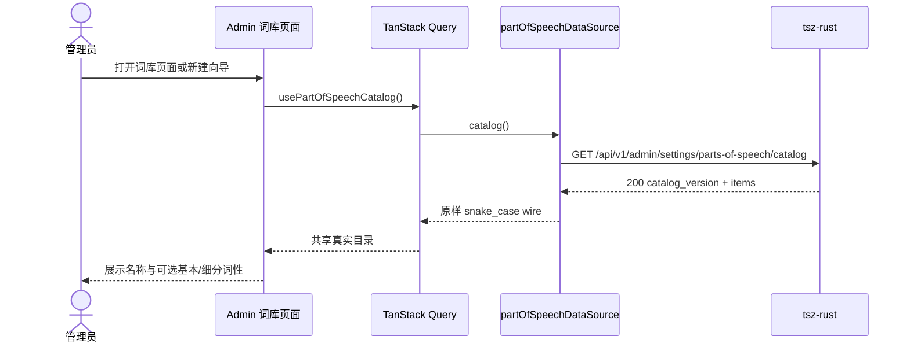
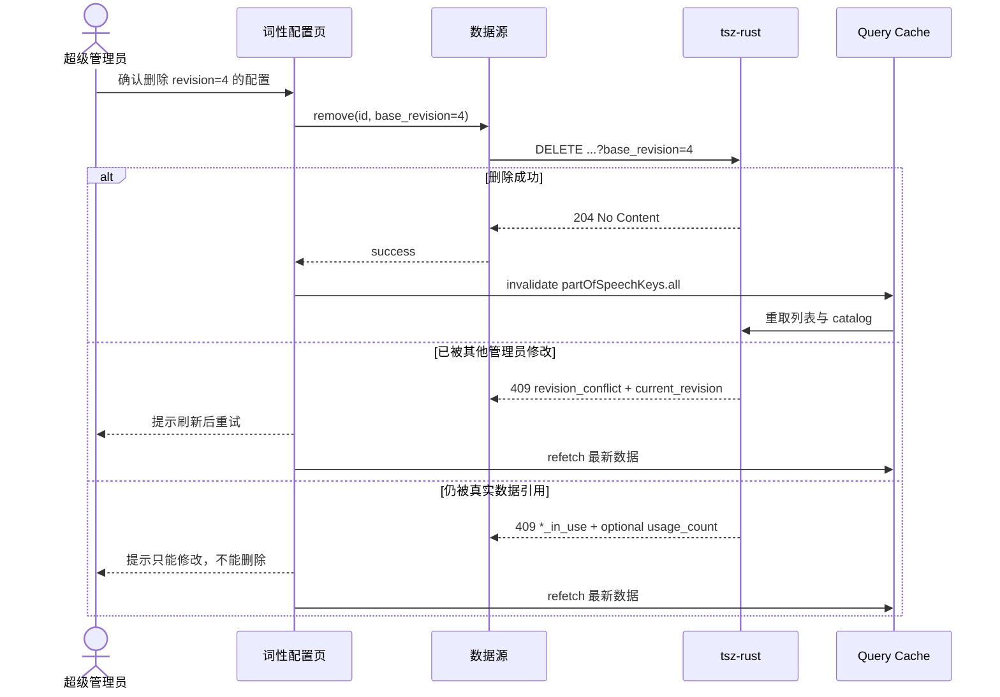

# 管理后台词性配置真实后端对接技术设计文档

## 方案概述

沿用现有 `partOfSpeechDataSource` 和 TanStack Query hooks，不重写页面；从底层把预埋契约升级为 tsz-rust 当前权威契约，并把词性 mock 从 `VITE_ADMIN_WORDS_MOCK` 中拆出。新增 `VITE_ADMIN_PART_OF_SPEECH_MOCK`：本地开发默认可用 mock，普通 production 默认真实，tshb-test 的 test mode 构建显式设置“words mock=true、part-of-speech mock=false”。

`@tsz/api-client` 同步 `tsz-rust/docs/openapi.json`，9 个路径移出 PENDING；DELETE 改为带 `base_revision` query。`@tsz/types` 抽出 OpenAPI 共用的 `Actor` 与 `ProblemMeta`，请求层把 RFC 9457 `meta` 同时暴露到 `ProblemDetails.meta` 和 `HttpError.meta`。UI 删除 mutation 传入行记录 revision，已知错误按稳定 code 映射并在冲突后刷新。

混合模式下，所有 React catalog 消费者直接读取真实接口；单词 CRUD 仍使用 mock。mock 单词保存的词性校验切换为“外部 catalog 已由 UI 约束”的过渡模式，避免用内部 seed 拒绝真实新增编码；它不伪造服务端 usage_count，也不把浏览器草稿上传后端。

## 契约依据与已确认差异

权威依据：

- `../tsz-rust/docs/openapi.json`：9 个已发布路径、请求/响应 schema、状态码与安全声明；
- `../tsz-rust/docs/frontend-integration.md` §7：排序、唯一性、revision、错误码、catalog 联动和过渡期约束；
- `packages/api-client/src/openapi.snapshot.json`：由 `pnpm --filter @tsz/api-client sync:openapi` 生成的前端路径快照。

现有前端与真实契约存在以下差异：

1. OpenAPI 快照尚未同步，9 个端点仍错误地留在 PENDING 白名单；
2. 两个 DELETE 客户端、hook 和 UI 都只传 id，缺少必填 `base_revision` query；
3. `PartOfSpeechActor` 是局部重复类型，OpenAPI 使用共用 `Actor`；
4. `ProblemDetails` 没有 `meta`，`HttpError.meta` 仍命名为词条专属 `AdminWordApiErrorMeta`；
5. 基本/细分词性数据源与 words 共用一个 mock 开关，无法在 tshb-test 单独切真实；
6. 词性 mock 的字段错误、细分冲突、404 和 DELETE revision 行为与 §7.6 仍有漂移；
7. api-client 注释仍称后端未落地。

## 代码影响范围

### `packages/types`

- 修改 `packages/types/src/api.ts`
  - 新增共用 wire 类型 `Actor { id, display_name }`；
  - 新增通用 `ProblemMeta`，保留现有词条错误上下文并加入 `usage_count`、`part_of_speech_id`、`code`；
  - `ProblemDetails` 新增可选 `meta?: ProblemMeta`。
- 修改 `packages/types/src/admin-word-v2.ts`
  - 将 `AdminWordApiErrorMeta` 改为 `ProblemMeta` 的兼容别名，避免现有调用方破坏性迁移；新代码统一使用 `ProblemMeta`。
- 修改 `packages/types/src/part-of-speech.ts`
  - `created_by` / `updated_by` 使用共用 `Actor`；保留 `PartOfSpeechActor` 类型别名兼容已有引用；
  - 新增 DELETE query wire 类型，例如 `DeletePartOfSpeechQuery { base_revision: number }`，基本/细分删除共用。

所有字段继续保持 snake_case。`Actor.id` 必须是 string，因为系统种子 actor 为 `"system"`，不能收窄为 UUID。

### `packages/api-client`

- 运行 `pnpm --filter @tsz/api-client sync:openapi` 更新 `packages/api-client/src/openapi.snapshot.json`。
- 修改 `packages/api-client/src/endpoints.contract.test.ts`，从 PENDING 删除 9 个词性条目，使其正式受 OpenAPI 路径/方法校验。
- 修改 `packages/api-client/src/admin.ts`
  - 更新“后端尚未落地”注释；
  - `remove(id, { base_revision })` 请求 `/settings/parts-of-speech/{id}?base_revision=...`；
  - `removeSubPart(id, subId, { base_revision })` 请求对应子路径 query；
  - query 继续复用现有 `qs`，不把 revision 放 DELETE body。
- 修改 `packages/api-client/src/http.ts`
  - `HttpError.meta` 改用通用 `ProblemMeta`；
  - `toAdminWordApiErrorMeta` 重命名为通用解析器；
  - 严格校验已知可选字段，无法识别的 meta 不参与业务分支；
  - 构建 `ProblemDetails` 时带上同一份解析后 meta，保证 `error.problem?.meta` 与 `error.meta` 一致。
- 修改 `packages/api-client/src/admin.test.ts`、`http.test.ts` 和契约测试，覆盖 DELETE query、204 空 body、通用 meta 与 9 个正式端点。

### `apps/admin` 环境与数据源

- 修改 `apps/admin/src/lib/env.ts`、`env-flags.ts`、`env.test.ts` 和 `apps/admin/vite.config.ts`
  - 新增并严格解析 `VITE_ADMIN_PART_OF_SPEECH_MOCK`；
  - 非生产默认启用、生产默认关闭；
  - 与 words mock 一样，只允许开发环境或显式 test mode 构建开启，普通 production fail closed。
- 重构 `apps/admin/src/features/dictionary/dataSource.ts`
  - 抽出唯一的 lazy `resolveAdminWordsMockRuntime()`，避免两个开关组合时重复实例化；
  - words resolver 只看 `ADMIN_WORDS_MOCK`；词性 resolver 只看 `ADMIN_PART_OF_SPEECH_MOCK`；
  - 任一 mock 开启时才注册登出清理；
  - 支持四种组合并测试：全真实、全 mock、words mock + 词性真实、words 真实 + 词性 mock；
  - 更新注释，不再宣称 dictionary 全域必须同源。
- 修改 `apps/admin/src/features/dictionary/mock/adminWordsMock.ts`
  - DELETE 接收 `base_revision` 并在引用检查前校验 revision；
  - 对齐 `invalid_part_of_speech`、`sub_part_of_speech_conflict`、`part_of_speech_not_found`、`sub_part_of_speech_not_found` 和 meta；
  - 增加创建参数标记 catalog 校验来源。全 mock 时继续按内部 catalog 严格校验；words mock + 词性真实时不使用内部 seed 否决 UI 已从真实 catalog 选择的编码；
  - 该过渡模式只影响浏览器 mock 单词保存校验，不修改真实设置 CRUD，也不伪造真实引用数。
- 修改 `apps/admin/src/features/dictionary/dataSource.test.ts` 和 `mock/adminWordsMock.test.ts`，覆盖四种选择、单例懒加载、登出清理、revision、错误码和外部 catalog 模式。

### `apps/admin` hooks 与页面

- 修改 `apps/admin/src/features/dictionary/part-of-speech/api.ts`
  - 基本删除 mutation 参数改为 `{ id, base_revision }`；
  - 细分删除 mutation 参数增加 `base_revision`；
  - mutation 成功后继续失效 `partOfSpeechKeys.all`，同时刷新 catalog、管理列表和细分列表。
- 修改 `PartOfSpeechSettings.tsx`
  - 删除基本词性时传 `item.revision`；
  - 细化 `sub_part_of_speech_conflict`、not found、输入错误等稳定 code 的中文提示；
  - `revision_conflict`、in-use 失败后保留现有刷新行为。
- 修改 `SubPartOfSpeechDrawer.tsx`
  - 删除细分词性时传 `item.revision`。
- 修改相关 hooks 与组件测试，断言正确 revision、失效缓存、错误提示和刷新行为。
- 智能词库页面不需要逐个改调用点：它们已经统一使用 `usePartOfSpeechCatalog()`，数据源切换后自然读取真实 catalog。需用现有 catalog/向导测试证明加载失败降级和真实新增编码选择没有回归。

### 部署编排

- 修改 `deploy/deploy-admin.sh`：test mode 构建显式设置
  - `VITE_ADMIN_WORDS_MOCK=true`；
  - `VITE_ADMIN_PART_OF_SPEECH_MOCK=false`；
  - 保留 `VITE_WORD_CREATION_WIZARD=true`。
- 更新脚本注释，说明 tshb-test 是“单词 mock + 词性真实”，避免后续误以为整个 dictionary 都是 mock。
- 不改 nginx：现有 `/api/v1/` 反代已经覆盖这些路径，未登录探测返回 401 证明路由和反代存在。

## 后端对接

### 端点与成功响应

admin api-client 的 base URL 已含 `/api/v1/admin`，使用以下相对路径：

| 方法   | 相对路径                                                                     | 成功响应                         |
| ------ | ---------------------------------------------------------------------------- | -------------------------------- |
| GET    | `/settings/parts-of-speech/catalog`                                          | 200 `{ catalog_version, items }` |
| GET    | `/settings/parts-of-speech?q=&page=&page_size=`                              | 200 `{ items, pagination }`      |
| POST   | `/settings/parts-of-speech`                                                  | 201 `PartOfSpeechConfig`         |
| PATCH  | `/settings/parts-of-speech/{id}`                                             | 200 新 `PartOfSpeechConfig`      |
| DELETE | `/settings/parts-of-speech/{id}?base_revision={revision}`                    | 204 无 body                      |
| GET    | `/settings/parts-of-speech/{id}/sub-parts`                                   | 200 `{ items }`                  |
| POST   | `/settings/parts-of-speech/{id}/sub-parts`                                   | 201 `SubPartOfSpeechConfig`      |
| PATCH  | `/settings/parts-of-speech/{id}/sub-parts/{sub_id}`                          | 200 新 `SubPartOfSpeechConfig`   |
| DELETE | `/settings/parts-of-speech/{id}/sub-parts/{sub_id}?base_revision={revision}` | 204 无 body                      |

catalog 允许任意有效 admin；其余 8 个管理端点要求 `super_admin`。鉴权继续由现有 admin api-client 注入 Bearer、401 refresh 和 403 全局处理，不新增页面私有鉴权逻辑。

### revision 与删除顺序

- PATCH body 的 `base_revision` 和 DELETE query 的 `base_revision` 都取自当前行/子项响应；
- 后端先锁行比较 revision，再检查引用；旧版本返回 409 `revision_conflict`；
- revision 一致但被引用时返回对应 `*_in_use`；无引用才删除并返回 204；
- 前端不依据列表里的 `usage_count === 0` 推断删除必定成功，服务端事务检查是最终权威。

### 稳定错误码

页面按以下 code 分支：

- 400：`invalid_query`、`invalid_part_of_speech`、`invalid_path_parameter`；
- 404：`part_of_speech_not_found`、`sub_part_of_speech_not_found`；
- 409：`part_of_speech_conflict`、`sub_part_of_speech_conflict`、`part_of_speech_in_use`、`sub_part_of_speech_in_use`、`revision_conflict`；
- 422：`invalid_request_body`；
- 401/403/500：沿用请求层和页面通用失败处理。

`ProblemMeta` 允许 `usage_count`、`current_revision`、`part_of_speech_id`、`code`。这些字段全部可选；尤其数据库外键并发兜底的 in-use 错误允许没有 usage_count，UI 不得强制解构。

### 后端缺口

本次核对未发现新增后端接口或字段缺口。9 个路径、DELETE query、actor、Problem Details 和错误码均已在 tsz-rust 文档中明确。本功能不产生 Rust diff；若联调发现 OpenAPI 与运行实例不一致，停止前端放量并把差异回报后端，而不是在前端兼容两个相互冲突的 wire。

## 复用与约定

- wire 类型只放 `@tsz/types`，snake_case 直出；不在组件或请求层复制响应结构。
- HTTP endpoint 只放 `@tsz/api-client`；admin 通过已有 `api.partOfSpeechSettings` 和 data source facade 调用。
- 目录查找、label 和选项生成继续复用 `part-of-speech/catalog.ts`，不新增静态词性枚举。
- catalog query key 继续全业务共享；mutation 统一失效根 key，避免设置页与向导各自维护缓存。
- admin UI 沿用 antd v6、现有路由门禁和 `@tsz/shared/auth` 驱动的登录态，不引入 tailwind / `@tsz/ui`。
- 部署仍遵守“main CI 全绿后才上 tshb-test”；本功能分支只修改部署参数，不从 feature 分支直接发布服务器。

## 数据流 / 时序

### 读取真实 catalog



### 带 revision 删除并刷新



### tshb-test 混合模式

```text
VITE_ADMIN_WORDS_MOCK=true
    └─ 单词列表 / 检测 / 创建 / 保存 / 发布 → 浏览器 mock runtime

VITE_ADMIN_PART_OF_SPEECH_MOCK=false
    ├─ 词性配置页 CRUD → tsz-rust
    └─ 全部 usePartOfSpeechCatalog 消费者 → tsz-rust catalog
```

mock 单词数据不会进入 tsz-rust，因此真实 usage_count 不包含它。mock 保存依赖 UI 的真实 catalog 选择约束，不再拿内部 seed 对真实新增编码做第二套相互冲突的判定。

## 测试策略（概览）

代码动工阶段先调用 `test` skill 细化用例矩阵，再写测试。

### 单元测试

- `@tsz/types` / HTTP：通用 ProblemMeta 的合法、缺省和畸形解析；`ProblemDetails.meta` 与 `HttpError.meta` 一致。
- api-client：9 个方法的路径、方法、query/body；两个 DELETE 编码 `base_revision`；204 空响应。
- env：新开关默认值、严格布尔解析、production fail closed、test mode 允许显式 mock。
- data source：四种开关组合、真实/mock 委派、mock runtime 单例、登出清理、生产包不走 mock 分支。
- mock：DELETE revision 成功/冲突、引用保护顺序、基本/细分稳定错误码、全 mock 严格 catalog 校验、混合模式不拒绝真实目录编码。
- hooks/UI：删除传 revision、成功失效根 query、冲突和 in-use 后刷新、细分冲突与 404 提示。

### 契约与集成测试

- 同步 OpenAPI 快照后运行 endpoint contract test，确认 9 个路径正式命中 spec、PENDING 台账保鲜。
- 运行现有 catalog、词库列表、legacy editor 和 V2 wizard 测试，确认统一 catalog 数据源及失败降级无回归。
- 构建 admin test mode 后检查产物配置，确认 words mock 保留、词性请求不走 mock runtime。

### 真实联调与手测

- 无 token 请求 catalog 得到 401，验证 nginx/API 路由；
- 使用普通 admin 验证 catalog 200、配置管理受限；
- 使用 super_admin 完成基本/细分列表、搜索、创建、修改、删除、刷新持久化；
- 用两个会话制造 revision conflict；用已有真实引用验证 in-use；
- 新增配置后打开智能词库列表、legacy 编辑和 V2 向导，确认真实名称与选项出现；
- 在 tshb-test 混合模式中选择真实新增编码并完成 mock 草稿保存，确认不会被内部 fixture 拒绝。

## 风险与回滚

### 风险

1. **开关耦合误伤单词页面**：直接关闭 `ADMIN_WORDS_MOCK` 会把未落地的单词接口也切真实并产生 404。通过独立开关和四组合测试隔离。
2. **DELETE 漏 revision**：真实接口会返回 400 `invalid_query`。类型签名强制 query，并从 UI 行对象传值。
3. **浏览器 mock 与真实 catalog 不同源**：内部 seed 可能拒绝真实新增编码。混合模式禁用这层重复领域判定，由真实目录 UI 约束选择；全 mock 模式仍严格校验。
4. **引用数认知偏差**：真实服务端看不到 mock 草稿。验收与界面说明明确 usage_count 只代表真实数据，不合并或伪造计数。
5. **跨管理员缓存滞后**：当前没有推送/轮询，另一会话最多在 staleTime 或手动刷新后看到新目录；写冲突由 revision 兜底，不会静默覆盖。
6. **ProblemMeta 泛化回归词条错误处理**：保留 `AdminWordApiErrorMeta` 兼容别名，并用现有词条 HTTP 测试覆盖全部旧字段。
7. **后端运行实例与文档漂移**：真实联调逐项核对状态码和 wire；发现差异即停止部署，不在前端吞错或猜测字段。

### 回滚

- 代码级回滚：撤销独立开关和契约对接提交，恢复上一版 admin 产物。
- tshb-test 快速回滚：将 `VITE_ADMIN_PART_OF_SPEECH_MOCK=true` 重新构建并按现有脚本部署，可恢复整套 dictionary mock；该开关只允许 test mode，不影响 production 安全策略。
- 数据不回滚：真实 CRUD 已写入 tsz-rust，切回前端 mock 不会删除或改写服务端数据。若误操作真实配置，必须通过正常 CRUD 或后端运维流程恢复，不能靠前端回滚伪造数据库状态。
