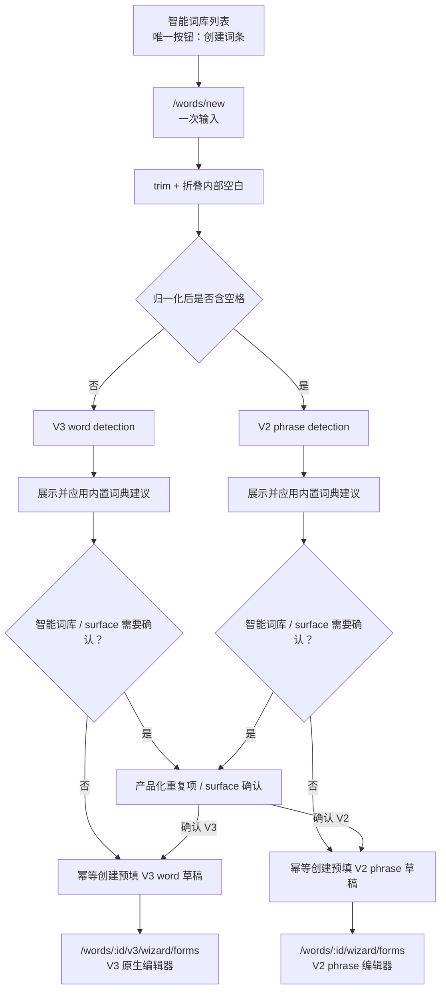

# Smart Lexicon V3 管理端编辑器 UI 恢复与统一创建入口技术设计文档

## 方案概述

本方案保留现有 V2/V3 契约与两套草稿编辑器，在创建前增加一个统一的前端编排层：`/words/new` 接收一次输入，按固定空白规则归一化并分类；单词调用现有 V3 detect/create，短语调用现有 V2 detect/create。检测返回后先把内置词典建议映射成产品摘要，并用同一 detection 触发后端预填创建；只有智能词库重复、surface 匹配或后端策略要求确认时停留在创建页，无冲突则不增加第二次点击，自动创建并跳转到对应原生编辑器。

V3 编辑器不复用 V2 数据组件，也不做 V3 → V2 转换。改造集中在 V3 的呈现层和布局层：保留现有 `model.ts`、`operations.ts`、`saveFlow.ts`、`readiness.ts`、API identity guard、稳定 UUID 和请求时序；通过中文展示映射、分层卡片、摘要侧栏、统一操作区、响应式 CSS 和可访问名称，让 V3 原生组件使用已经在 V2 Admin 中验证过的产品语言。

不选择以下方案：

- **继续保留两个创建按钮**：仍会把版本分流暴露给管理员，违背唯一入口目标。
- **在统一页先让用户选择单词/短语**：只是把两个按钮换成选择器，没有解决产品问题。
- **先进入检测页，再显示“继续创建”**：无警告场景仍产生不必要的第二次确认，违背一次提交自动继续。词典建议会自动展示和应用，但不是新的审批步骤。
- **只显示内置词典 matched/not_found**：丢失英美主词、基本词性、词形和音标建议，是明确的产品能力退化。
- **将 V3 映射成 V2 wizard**：无法无损表达多 base、一形多组、同类型多词形、多发音和稳定 membership，明确禁止。
- **重做一套 V3 状态模型**：现有 V3 save/dirty/conflict/impact/publish 状态机已有完整覆盖；本次只改呈现与创建编排，避免扩大风险。

## 现状证据

### 创建入口与路由

- `apps/admin/src/features/dictionary/SmartDictionary.tsx` 当前将“创建单词”导航到 `/words/new/v3`，将“创建短语”导航到 `/words/new?kind=phrase`。
- `apps/admin/src/router.tsx` 当前把 `/words/new` 限定为 V2 phrase 兼容入口，非 phrase 会重定向到 `/words/new/v3`。
- `apps/admin/src/pages/WordCreateV3.tsx` 单独挂载 `V3CreateEntryStep`，成功后进入 `/words/:id/v3/wizard/forms`。
- `apps/admin/src/features/dictionary/word-creation/CreateEntryStep.tsx` 已包含 V2 检测、词典建议、重复项、完整 surface snapshot 和 V2 创建能力，但当前要求先点击“词典检测”再点击创建。
- `apps/admin/src/features/dictionary/word-creation-v3/V3CreateEntryStep.tsx` 已包含 V3 检测、surface snapshot、幂等创建和过期响应保护，但文案与流程直接暴露 V3、检测和工程状态。
- V3 detection 的 `BuiltinDictionaryEvidenceV3` 在 `matched` 时已正式包含 `suggested_pos`、`suggested_forms`、`coverage`、`provenance`、地区拼写与多条发音证据；`docs/features/smart-lexicon-v3/requirements.md` 的“新建与检测”第 2 条也明确要求返回词典证据、已有 surface 候选和建议词性/词形。后端能力与契约没有丢失。
- 回归发生在新建的 `V3CreateEntryStep.tsx`：它从零实现了最小 detect/create/idempotency/surface 状态机，却把全部内置词典 evidence 压缩成 `内置词典：${detection.builtin_dictionary.status}`，没有迁移 V2 `CreateEntryStep` 的英美主词确认、建议词性、词形和音标展示。V3 create DTO 只接受 `detection_id`，因此建议应用必须继续由后端 canonical 创建结果承载，前端不能另造建议写入 DTO。
- 现有 `V3CreateEntryStep.test.tsx` 主要保护请求身份、异步过期、创建幂等与 surface acknowledgement；fixture 默认多为 `not_found`，没有断言 `matched` 建议的产品化内容、`unavailable` 与 `not_found` 的差异，也没有建立 V2/V3 建议 UI parity。质量门因此能证明状态机正确，却不能发现产品能力退化。
- `d707328` 将列表入口收敛成“创建词条”；`49e3bdc` 又明确拆分成两个按钮并更新单元/e2e 断言。恢复唯一入口应作为新的产品决策实现，而不是以冲突修复名义回滚整个 V3 提交。

### V3 编辑器

- `V3WordCreationWizard.tsx` 已集中管理 canonical word、forms/meanings dirty、revision 冲突、影响确认、问题导航、异步命令互斥和步骤切换。
- `operations.ts` 与 `model.ts` 已按稳定 UUID 实现 POS、变化组、共享关系、词形、地区变体、发音及 meanings 节点操作。
- `V3WordCreationLayout.tsx` 当前只有标题、英文状态、`Smart Lexicon V3 · revision`、Steps、问题列表和单列内容。
- `v3-layout.css` 与 `v3-forms.css` 合计约 77 行；V2 `word-creation.css` 约 2199 行，已包含摘要侧栏、步骤状态、卡片层级、操作区和多档响应式经验。
- forms 组件目前直接显示 `concrete form`、`membership`、原始 form type 与 UUID 尾段；meanings/examples 的大量 `aria-label` 拼入原始 ID。
- preview/publish 当前显示原始 form type、dialect、node type、node ID、blocked code；publication history 还提供完整 publication JSON。

### 契约边界

- `packages/types/src/admin-word-v3.ts` 已正式表达 `forms[] + form_groups[].members[]`、多 pronunciation、stable node location、impact、validation、publication 和 lifecycle 语义。
- `packages/api-client/src/admin-word-schema.ts` 与 `apps/admin/src/features/dictionary/word-creation-v3/api.ts` 已在响应 schema、请求路径身份、entry/publication 身份不一致时 fail closed。
- V2/V3 共用 `/lexicon/detections`、`/lexicon/entries` 和 surface snapshot 路径，通过正式 discriminator 与显式客户端方法区分。
- 本功能不需要也不允许修改 `@tsz/types`、`@tsz/api-client` OpenAPI snapshot 或后端。

## 总体架构



统一只发生在“草稿创建前”。草稿建立后仍以 `schema_version` 和 `kind` 进入各自的原生编辑、保存、校验与发布路由，不建立跨版本公共编辑 DTO。

## 统一创建入口设计

### 路由决策

- `/words/new` 改为唯一 canonical 产品入口，挂载统一创建页。
- `/words/new?kind=word` 与 `/words/new?kind=phrase` 不再决定 UI；兼容访问时仍进入同一页面，由真实输入分类。
- `/words/new/v3` 保留为兼容路由并重定向到 `/words/new`，不再渲染独立 V3 创建 UI。
- 草稿创建后的路由保持不变：
  - V3 word：`/words/:wordId/v3/wizard/:step`
  - V2 phrase：`/words/:wordId/wizard/:step`
- 列表、空状态、返回入口和测试全部只生成 `/words/new`。

这样可以删除创建前的版本分流，同时避免改动已保存书签中的编辑路由。兼容创建深链不携带词条文本，因此不会绕过统一分类。

### 输入归一化与分类

新增无副作用纯函数，使用同一个结果做校验、分类、请求和回显：

```ts
export type ClassifiedEntryInput = {
  normalized: string;
  kind: "word" | "phrase";
};

export function classifyEntryInput(raw: string): ClassifiedEntryInput {
  const normalized = raw.trim().replace(/\s+/gu, " ");
  return {
    normalized,
    kind: normalized.includes(" ") ? "phrase" : "word"
  };
}
```

实现时的约束：

1. 空值和字符集校验在网络请求前执行；现有 `headwordIssue` 复用，但接收归一化后的值。
2. 长度限制按归一化结果计算，避免多个粘贴空白制造错误分类。
3. `-`、ASCII `'` 与弯撇号 `’` 不参与分词；只有折叠后真实存在的半角空格决定 phrase。
4. 归一化结果是本次 detection 的唯一输入。输入框可以在提交时同步显示归一化值，避免用户看到的内容与请求不同。
5. 后端 normalized surface/headword 仍是落库权威；若响应 request echo、kind 或 entry_kind 与本次分支不一致，沿用 fail-closed 策略并提示“词条检查结果不一致，请刷新后重试”，不自动改走另一分支。

### 创建状态

统一创建组件使用互斥的判别状态，避免 V2/V3 结果串流：

```ts
type UnifiedCreateState =
  | { phase: "editing" }
  | { phase: "checking"; request_id: symbol; kind: "word" | "phrase" }
  | { phase: "preparing"; branch: V2Preparation | V3Preparation }
  | { phase: "confirming"; branch: V2Confirmation | V3Confirmation }
  | { phase: "creating"; kind: "word" | "phrase" }
  | { phase: "error"; recovery: "retry" | "edit" | "reload" };
```

这里的 `request_id` 仅为组件内过期响应隔离，不进入 wire 或 UI。实现继续使用 mounted/generation ref 与同步 in-flight lock，React state 只负责渲染，不单独承担防双击。

状态规则：

- 修改输入：递增 generation，清空 detection、surface snapshot、确认和创建 key，回到 `editing`。
- 首次提交：生成该次 detection 对应的创建幂等键，进入 `checking`。
- detection 完成：进入 `preparing`，立即渲染产品化建议摘要；matched 使用同一 detection 预填，not_found 明确说明将创建空白草稿，unavailable 或建议无法安全解释则停止。
- 无智能词库/surface 警告：在同一用户提交链中从 `preparing` 自动进入 `creating`，不插入可点击的“检测完成”状态，也不为了延长展示时间引入人为延迟。
- 有警告：进入 `confirming`；完整 snapshot 到达且可确认前禁用主操作。
- 确认：复用当前 detection 和终页 token 创建，不重复发送无意义检测。
- detection/snapshot 过期或 policy changed：旧确认失效，重新执行检查并展示“匹配结果已更新，请重新确认”；不得自动创建。
- 网络未知结果：保留现有幂等 key 进行原样重试；只有正式错误要求新 key 时才更换。
- 创建成功：立即按响应中的 `schema_version/kind/id` 导航，不从输入猜测目标详情路由。

### V3 word 分支

复用 `createV3WordRequests()`：

1. `detect({ schema_version: 3, language: "en", kind: "word", surface })`；
2. 校验 response echo 与本次 normalized input；
3. `builtin_dictionary.status=matched` 时从 `suggested_pos` 和 `suggested_forms` 构造只读产品摘要：从 base form 的地区变体展示英式/美式“建议拼写”，按词性目录展示基本词性，按业务标签展示词形/地区，并汇总词典音标、实际发音与发音方式；不显示 provider、provenance、coverage 原始结构或枚举值，也不把建议拼写生成领域唯一主词或 legacy compatibility；
4. `not_found` 时展示“未找到词典建议，将创建空白草稿”；`unavailable` 时阻断并提供重试，不把不可用当未命中；
5. `requires_acknowledgement=false` 时自动 `createV3(idempotencyKey, { schema_version: 3, detection_id, kind: "word" })`，由后端使用该 detection 生成 canonical 预填 forms；前端不把建议翻译成 V2 或自行拼装 V3 write DTO；
6. 需要确认时继续使用 `useSurfaceSnapshotAny` 顺序加载完整 V3 snapshot，只在终页 token 有效时提交 `confirmed_surface_match_token`；确认页同时保留建议摘要，但两者分别标记为“将预填内容”和“已有词条提醒”；
7. 创建成功只接受 V3 envelope，并进入 V3 forms；导航 state 只携不含 ID 的来源提示，编辑器以 response canonical forms 为事实源，显示“已根据内置词典预填，请核对”；
8. 继续保留 idempotency conflict、surface confirmation、snapshot expired、policy changed、503 和 runtime schema 错误的现有安全处理。

### V2 phrase 分支

复用当前 `useDetectWordV2`、`useCreateWordV2`、词性目录和 `useSurfaceSnapshot`：

1. 向 V2 detection 提交归一化 `headword`；
2. 要求 response `entry_kind === "phrase"` 且 request echo 一致，否则 fail closed；
3. `builtin_dictionary.status=matched` 时使用后端返回的 headwords 与建议，不再要求用户重复输入；`not_found` 时使用 `{ mode: "unified", common: normalized }`；
4. matched 时使用与 V3 相同的信息层级展示英美主词、词性、词形和发音建议；不显示 V2、原始状态或内部 ID；
5. 保留现有词性目录完整性校验，检测建议引用未知词性时不得自动创建；
6. `smart_dictionary.status=clear` 时自动创建 V2 phrase；warning 时完整加载 V2 surface snapshot 后显示统一确认；blocked 时说明不能继续；
7. 创建输入仍只提交正式的 `detection_id`、确认后的 `headwords` 和可选 surface token，不新增前端契约；suggested forms 继续由后端按 detection 应用；
8. 成功后进入 V2 phrase forms，并通过导航 state 展示不含 ID 的“已根据内置词典预填，请核对”提示；后续 editor 完全沿用现状。

统一入口取消的是无警告场景的重复点击，不取消 V2/V3 后端建议、建议摘要、词性约束、surface 策略或创建幂等。

### 自动检测、建议预填与冲突确认的边界

三类状态不得折叠成一个“检测结果”：

1. **自动检测**负责取得后端权威的 normalized input、内置词典建议、智能词库匹配和 surface 决策。它由唯一主提交触发，不提供独立按钮。
2. **建议预填**回答“新草稿会带入什么”。`matched` 对 V2 展示正式英美主词，对 V3 展示 base form 地区建议拼写，并共同展示词性、词形和发音；`not_found` 说明为空白草稿；展示模型只读且 schema-aware，创建仍只提交正式 detection 引用，由后端生成 canonical 草稿。
3. **冲突确认**回答“已有相同/相似词条时是否继续新建”。智能词库 duplicate 按现有规则阻断，warning/surface acknowledgement 加载完整快照并等待明确确认，clear 不停留。普通词典命中不是冲突，不产生确认按钮。

建议卡在 detection 返回后立即渲染，并贯穿 `preparing`、`creating` 和 `confirming`；不设置人为最短停留时间。创建成功后，目标编辑器用一次性 navigation state 显示来源提示，而实际预填内容以创建响应中的 canonical forms/headwords 为准。刷新后即使提示消失，字段内容仍完整保留；不得把 navigation state 当成保存依据。

### 产品化确认视图

V2/V3 的原始 match 类型不同，确认卡使用现有 `surfaceSnapshot.ts` 生成的 schema-aware 产品视图，不做 V3 → V2 wire 转换。共同呈现字段为：

- 展示名称；
- 单词/短语；
- 草稿/已发布/已归档；
- 命中词面与业务原因；
- 响应可提供的词性、释义预览和关联来源；
- 已加载数量/总数；
- 继续创建的影响说明。

snapshot ID、cursor、token、policy name/epoch、schema version、word/sense/form ID 不进入可见文本或 aria name。技术信息只保留在请求上下文和测试 fixture。

重复候选按 entry 身份在展示层归并：同一词条命中主词、词形或发音等多个类别时显示一张候选卡和多个中文原因标签；详情抽屉/弹窗只展示契约已经提供的产品字段，不为了“详情”请求新后端接口，也不回退展示原始 ID 或 JSON。V2 duplicate 无 match category 时不伪造原因，V2/V3 surface snapshot 有 category/context 时按既有优先级展示。

## V3 编辑器呈现设计

### 保留与改造边界

保持原样或只做必要接线：

- `model.ts`：V3 wire ↔ 可写 meanings 视图、stable node identity；
- `operations.ts`：POS/group/member/form/variant/pronunciation 的原子操作；
- `saveFlow.ts`：命令互斥、supersede、canonical replacement；
- `readiness.ts`：步骤完成度与问题聚合；
- `problem.ts`：错误分类；
- `api.ts`：schema 与 path identity guard；
- `V3WordCreationWizard.tsx` 中的 canonical/dirty/conflict/impact/publish 状态语义。

重点改造：

- `V3WordCreationLayout.tsx` 与 `v3-layout.css`：产品外壳、侧栏、状态、操作区、响应式；
- forms 子组件与 `v3-forms.css`：中文层级、矩阵、复用关系、地区与发音；
- `V3MeaningsAndExamplesStep.tsx`：卡片层级、中文 label、序号、可访问名称；
- `V3PreviewAndPublishStep.tsx`：业务预览、校验/影响/发布文案；
- `V3PublicationHistory.tsx`：业务历史与详情，移除原始结构展示。

### 中文展示映射

在 `word-creation-v3` 内新增单一呈现映射模块，供 forms、meanings、preview 和 history 使用。它只把正式枚举/状态映射为中文，不改变 wire 值：

| 内部值/概念                  | 产品文案                                  |
| ---------------------------- | ----------------------------------------- |
| `concrete form`              | 词形                                      |
| `membership`                 | 在变化组中使用 / 复用已有词形             |
| `base`                       | 原形（允许多条，不附加“唯一”语义）        |
| `third_person_singular` 等   | 第三人称单数 / 现在分词 / 过去式等        |
| `common` / `uk` / `us`       | 通用 / 英式 / 美式                        |
| `normal` / `strong` / `weak` | 常规 / 强读 / 弱读                        |
| draft/published/archived     | 草稿 / 已发布 / 已归档                    |
| sentence link `role`         | 主关联 / 上下文关联                       |
| definition mode              | 中文释义 / 中文例句 / 英文释义 / 英文例句 |
| publication block code       | 可理解的发布受限原因                      |
| impact node type             | 词形 / 发音 / 词义 / 例句 / 发布内容等    |

词性优先从现有词性目录读取 `name_zh`。未知枚举或后端新增 code 不直接显示原值，使用“未识别类型”“存在受影响内容”等安全兜底，并保留日志/内部对象用于诊断。

### 外壳与侧栏

桌面布局采用 `aside + main` 两列：

- 页头：返回智能词库、词条展示名、中文状态、未发布修改提示；不显示版本名或 revision。
- 侧栏：创建信息摘要、四步导航、完成/待处理计数、保存状态。
- 主区：当前步骤标题、说明、步骤级问题、编辑卡片和操作栏。
- 问题列表以业务分组去重；同一个稳定 issue 可以同时驱动侧栏计数和步骤定位，但只在一个主要位置展开全文。
- archived 或只读 publication view 仍使用同一外壳，通过清晰只读提示和禁用操作表达，不靠灰色状态代码。

现有 Steps 可以保留为视觉组件，但数据来源统一为 `STEP_ORDER + readiness + dirtySteps`，避免 Steps、侧栏和内容各自推导状态。

### forms 层级

渲染结构保持 V3 原生关系：

```text
词性
└── 词形变化组 1..n
    ├── 新增词形
    ├── 复用已有词形
    └── 组内词形顺序
        └── 词形（稳定 form id）
            ├── 词形类型
            ├── 通用 或 英式+美式
            └── 每个地区 0..n 条发音
```

实现规则：

- `forms[]` 仍由 POS 拥有，group 仍只保存稳定 member；组件不能把同一 form 复制成多个对象。
- 同一个 form 在多个组出现时编辑同一个 canonical form；视觉上以“已在 2 个变化组中使用”提示，不显示关系 ID。
- 同类型多条使用 form ID 作为 key，当前显示序号只作为标题。
- 移除最后一个关系时继续拒绝普通移除，并提供“删除该词形及其所有使用位置”的影响确认。
- 地区结构切换继续使用现有显式 mapping/确认逻辑；确认卡显示将保留/覆盖哪些拼写和发音，不显示 variant ID。
- pronunciation 继续按稳定 ID 排序；序号变化不重铸 ID。
- 表单定位保留 `data-v3-node-id` 等非展示属性；按钮 aria-label 使用“上移词形 2”“删除第 1 条发音”等视图序号。

### meanings/examples 层级

- 每个 POS 为一级分区；sense group、grammar structure、sense、definition、sentence、relation 使用有序 Card/Collapse。
- 标题按当前可见顺序生成，例如“语法结构 1”“释义 2”“例句 1”；ID 仅用于 key、数据更新和 issue location。
- 核心字段在卡片首层，高级关系与来源范围按需展开，避免 1000 行表单在视觉上完全平铺。
- Select option 的 `value` 保持稳定 ID/code，label 使用中文业务名；管理员不能编辑 value。
- 例句主关联保持锁定语义，上下文关联继续可编辑；`role` 不进入 UI。
- 删除、排序和折叠只改变数组顺序或显式节点操作，不根据序号重新生成节点。
- `issueNavigation.ts` 继续根据 stable node location 找目标；呈现层根据目标计算当前序号和中文 breadcrumb。

### 核对、发布与影响确认

- 预览从 canonical `AdminWordV3` 派生只读业务卡，不序列化原始对象。
- forms 预览按“词性 → 变化组 → 词形 → 地区/发音”展示；共享词形可提示被多个组使用，但只展示一次详细内容。
- meanings 预览按“词性 → 词义 → 定义/例句/关联”展示。
- 校验 issue 按步骤/业务节点中文聚合；点击继续使用 stable node location 导航。
- impact 不显示 `node_type + node_id`，而是按中文类别计数并展示后端可理解原因；未知 reason 使用中性兜底。
- publication capability block code 经映射后呈现，不直接显示 code。
- validate → impact/surface confirmation → publish 的请求顺序、base revision、幂等 key 与失败恢复保持现状。

### 发布历史与生命周期

- 历史列表显示“第 N 次发布”、展示名称、发布时间、发布人和“当前版本”；不显示 V2/V3 badge 或 revision。
- 详情根据 snapshot 的 schema discriminator 使用各自只读 presenter，但输出统一业务结构。
- 删除 `PublicationStructureSnapshot` 的 UI 入口，不渲染完整 JSON。
- V2 历史继续永久只读；符合现有 capability 的 V3 历史继续允许激活。
- 激活仍受 unsaved changes、surface confirmation、idempotency、revision/lifecycle revision 和 409 canonical refresh 保护。
- 归档/恢复继续由列表当前 lifecycle command 提供；V3 archived 详情保持只读，不新建第二套归档入口。

## 响应式布局

响应式规则集中在 V3 CSS，不把 viewport 判断写进数据组件：

| 宽度   | 外壳                                           | 复杂字段                                                | 操作区                           |
| ------ | ---------------------------------------------- | ------------------------------------------------------- | -------------------------------- |
| 1440px | 限宽容器；约 260–280px sticky 侧栏 + 弹性主区  | 英美双栏；发音行保持矩阵；多列摘要                      | 右对齐、可 sticky                |
| 1024px | 约 240px 侧栏 + `minmax(0, 1fr)` 主区          | 英美双栏按内容收缩；长 label 换行                       | 保持一行优先，空间不足换行       |
| 768px  | 单列；摘要移到内容上方或可展开                 | 英美、发音、Descriptions 降为单列                       | 主次操作换行，主操作仍明确       |
| 390px  | 12–16px 页面内边距；单列卡片；无页面级横向滚动 | Tabs 可滚动但内容不横滚；输入、Select、按钮占满可用宽度 | 底部操作安全换行，不遮挡最后一项 |

所有 Grid/Flex 子项设置 `min-width: 0`，长词面、错误文案、标签和按钮允许换行。只允许 Ant Tabs 自身的受控横向滚动，不允许整个页面或表单矩阵横向滚动。

## 键盘与基础无障碍

- 统一输入使用真实 label；Enter 与点击主按钮触发同一 submit handler。
- 提交、检查和创建期间主按钮使用 loading/disabled 与同步 ref 双重互斥。
- antd Tabs、Select、Collapse、Modal 保持组件原生键盘行为，不用点击 div 替代按钮。
- 所有 icon-only 排序/删除按钮提供中文 aria-label，按当前业务序号描述且不包含 UUID。
- 错误摘要使用可感知区域；提交失败后焦点进入摘要，点击问题后聚焦具体字段。
- Modal 打开后焦点限制在确认区，关闭后回到触发控件。
- 状态同时使用文字/图标/结构，不只依赖颜色。
- DOM 中可用于定位的 `data-*` ID 不进入可访问名称；测试不得再以原始 UUID 作为面向用户断言。

## 数据流与时序

### 统一创建

1. 用户编辑 raw input；本地只保留输入，不预请求。
2. submit：归一化 → 校验 → 分类 → 建立 generation 与 idempotency key。
3. 按 kind 调用对应 detection；校验 response echo/discriminator，并把内置词典 evidence 映射成不含工程字段的建议摘要。
4. matched/not_found 且可安全继续时展示建议摘要；unavailable、未知必需词性或契约异常停止并反馈。
5. 智能词库 clear/无需 surface 确认：立即创建；warning：在保留建议摘要的同时加载完整 immutable snapshot 并等待确认；duplicate/blocked/error：停止并反馈。
6. 创建成功使用 response canonical word 决定路由，并传递仅用于来源提示的 navigation state；导航前释放离开保护。
7. 组件卸载或输入改变后，所有旧 promise 结果因 generation 不匹配被丢弃。

### V3 编辑与保存

1. detail GET 返回 canonical V3 draft，wizard 以 `word.id` 为 session key 初始化 forms/meanings。
2. UI 修改只更新对应稳定节点并设置步骤 dirty；presentation 序号不写回。
3. forms 保存前仍执行 impact；无影响直接保存，有影响/surface warning 等待确认。
4. save 成功以 response 替换 canonical、清对应 dirty 并更新 readiness；冲突时保留本地草稿。
5. validate issues 通过 stable node location 驱动步骤、POS、祖先卡片展开和字段聚焦。

### 发布与历史激活

1. 发布页先检查 dirty，再请求 validate。
2. valid 后按现有 V3 流程处理 impact/surface context，再幂等 publish。
3. history 以 entry ID 列表、以 publication ID 取详情；ID 只在请求和内部 key 中使用。
4. 激活前检查 dirty/capability，必要时确认 surface；409 或确认上下文失效后并行刷新 canonical 与 history，再允许下一次操作。

## 代码影响范围

### 列表、路由与页面

- `apps/admin/src/features/dictionary/SmartDictionary.tsx`
  - 两个创建按钮收敛为“创建词条”，只导航 `/words/new`。
- `apps/admin/src/router.tsx`
  - `/words/new` 改为统一入口；`/words/new/v3` 改为兼容重定向；移除 query kind 对产品路由的控制。
- `apps/admin/src/pages/WordCreate.tsx`
  - 挂载统一创建流程，并按创建响应进入 V3 word 或 V2 phrase 编辑路由。
- `apps/admin/src/pages/WordCreateV3.tsx`
  - 不再渲染独立创建 UI；若路由层直接重定向后成为本次改动产生的孤儿，则删除该页面及只属于它的测试。
- `apps/admin/src/features/dictionary/wordRouting.ts`
  - 仅在现有 schema-aware 编辑路由辅助需要时调整；保持已创建词条按 schema 路由。

### 统一创建流程

- 新增 `apps/admin/src/features/dictionary/word-creation/entryClassification.ts`
  - 归一化、分类与纯函数边界。
- 新增 `apps/admin/src/features/dictionary/word-creation/UnifiedCreateEntryStep.tsx`
  - 统一编排 V2/V3 detection、建议摘要、自动预填创建、智能词库/surface 确认和幂等恢复；展示模型按 schema 分支构造，不修改 wire。
- `apps/admin/src/features/dictionary/word-creation/CreateEntryStep.tsx`
  - 保留为 V2 既有能力参考；若统一入口落地后无调用方，不扩大本次范围做无关重构。
- `apps/admin/src/features/dictionary/word-creation/WordCreationWizard.tsx`
  - create mode 接受 V2/V3 创建结果并在进入 V2 内部状态前显式缩窄；resume/edit 仍只处理 V2。
- `apps/admin/src/features/dictionary/word-creation-v3/V3CreateEntryStep.tsx`
  - 将其可靠的 generation、幂等、surface 确认和错误处理迁入统一入口；迁移完成且无调用方后删除，避免保留第二套 UI。
- `apps/admin/src/pages/WordWizardV3.tsx` 与 V2 wizard 页面
  - 消费一次性 navigation state，显示“已根据内置词典预填，请核对”或“未找到词典建议，已创建空白草稿”；保存数据仍只来自详情响应。
- `apps/admin/src/features/dictionary/surfaceSnapshot.ts` 与 `useSurfaceSnapshot.ts(x)`
  - 优先直接复用；只有统一确认视图确有缺失的纯展示字段时才做最小扩展，不改变 snapshot/token 语义。

### V3 编辑器呈现

- 新增 `apps/admin/src/features/dictionary/word-creation-v3/presentation.ts`
  - 集中维护中文枚举、状态、能力阻断和影响类别映射；不产生 wire 转换。
- `apps/admin/src/features/dictionary/word-creation-v3/V3WordCreationLayout.tsx`
  - 页头、摘要侧栏、步骤完成度、dirty/冲突/问题区和外壳结构。
- `apps/admin/src/features/dictionary/word-creation-v3/v3-layout.css`
  - 两列/单列外壳、侧栏、卡片、操作区与 1440/1024/768/390 响应式规则。
- `apps/admin/src/features/dictionary/word-creation-v3/v3-forms.css`
  - 词性、变化组、词形、英美矩阵、发音行和移动端布局。
- `apps/admin/src/features/dictionary/word-creation-v3/components/V3FormsAndPronunciationStep.tsx`
- `apps/admin/src/features/dictionary/word-creation-v3/components/V3PosTab.tsx`
- `apps/admin/src/features/dictionary/word-creation-v3/components/V3FormGroupCard.tsx`
- `apps/admin/src/features/dictionary/word-creation-v3/components/V3ConcreteFormRow.tsx`
- `apps/admin/src/features/dictionary/word-creation-v3/components/V3PronunciationList.tsx`
  - 替换工程文案和 ID 展示，建立产品层级与不含 ID 的可访问名称；底层 operations 不变。
- `apps/admin/src/features/dictionary/word-creation-v3/V3MeaningsAndExamplesStep.tsx`
  - 中文字段、序号卡片、渐进层级、业务 aria-label；stable ID 更新逻辑不变。
- `apps/admin/src/features/dictionary/word-creation-v3/V3PreviewAndPublishStep.tsx`
  - 业务预览、问题/影响摘要、发布能力中文提示与一致操作栏。
- `apps/admin/src/features/dictionary/word-creation-v3/V3PublicationHistory.tsx`
  - 产品化列表/详情，移除 schema/revision/ID/JSON 展示，保留原生激活时序。
- `apps/admin/src/pages/WordWizardV3.tsx`
  - 只调整 slot 的产品化确认与操作栏接线；现有 impact/surface/save/publish 时序保持。

### 明确不修改

- `packages/types/src/admin-word-v3.ts`
- `packages/api-client/src/admin-word-schema.ts`
- `packages/api-client/src/openapi.snapshot.json`
- `packages/api-client/src/admin.ts` 的正式请求 DTO 与路径
- 后端仓、数据库与共享 OpenAPI
- `apps/web`

若实现过程中发现必须修改以上契约文件，说明本设计假设失效，应停止代码修改并回到技术评审，不得顺手扩契约。

## 后端对接

本功能不引入后端对接缺口，继续使用已经存在的正式能力：

- `POST /admin/lexicon/detections`：V2 phrase / V3 word 显式输入；
- `GET /admin/lexicon/surface-match-snapshots/{snapshot_id}`：V2/V3 immutable warning pages；
- `POST /admin/lexicon/entries`：按 schema 输入和 `Idempotency-Key` 创建；
- `GET /admin/lexicon/entries/{entry_id}`：schema-aware draft detail；
- forms impact/save、meanings save、validate、publications、publication detail、activate；
- archive/restore 与 batch lifecycle 继续由现有列表数据层使用。

鉴权、snake_case、schema discriminator、base revision、lifecycle revision、confirmation token 与 Idempotency-Key 均保持现状。前端不把本地分类字段添加到新 wire，只选择已有 V2 或 V3 正式输入。

## 复用与项目约定

- Admin UI 只使用 antd v6；不引入 tailwind 或 `@tsz/ui`。
- wire 继续 1:1 snake_case；组件局部 props/state 可使用 camelCase。
- 不手改 OpenAPI snapshot，不新增命名转换层。
- V2/V3 共用的是入口编排和纯展示能力，不共用会损失语义的数据组件。
- 继续使用 React `field.key`、稳定 UUID 和现有 model operations，不能以数组 index 作为保存身份。
- 保留 jsdom 的 matchMedia/ResizeObserver 垫片；大组件测试避免无范围的 `getByRole` 全树扫描。
- CSS 与文案改动限定在 V3 和统一入口，不顺手重构 V2 编辑器或其他 Admin 页面。

## 测试策略（概览）

首版设计批准后已经完整读取并使用 `test` skill，且在本目录建立了 `test-matrix.md`。本次建议能力增补批准后、继续新增或修改测试代码前，必须先更新矩阵并把下列回归场景落成明确 case；新增实现仍遵守“先设计测试、再写测试”的顺序。

### 纯逻辑

- trim、连续空格、Tab、换行、Unicode 空白折叠；
- 单 token、hyphen、ASCII/弯撇号、phrase 分类；
- 空值、字符集、长度边界；
- 中文展示映射与未知 code 安全兜底；
- 展示序号变化不影响 stable ID。

### 统一创建组件与路由

- 列表唯一按钮和 canonical/兼容路由；
- V3 word 无警告自动 detect → create → navigate；
- V2 phrase 无警告自动 detect → create → navigate；
- V2/V3 matched 建议摘要覆盖主词、词性、词形和发音，create 使用同一 detection，目标编辑器显示来源提示且 canonical 字段已预填；
- V2/V3 not_found、unavailable、未知词性分别验证空白继续、安全阻断和可重试，不能只断言状态字符串；
- matched fixture 必须至少含两个基本词性、英美地区建议拼写、多词形和多条发音，断言中文标签与具体建议值，禁止仅断言“已匹配”或 `status`；同时断言 V3 没有生成 legacy 主词/compatibility 写入；
- 重复候选覆盖同一 entry 多命中原因归并、词条类型/生命周期/原因/可用词性释义详情、分页完整性、键盘开关，以及 DOM/aria 不泄露内部 ID；
- V2/V3 warning 完整 snapshot、确认、过期、policy change、disabled；
- 双击、输入变化、旧响应、卸载、网络未知结果和 idempotency conflict；
- response echo/kind/schema 不一致 fail closed；
- 不出现选择器、检测按钮或二次无意义确认。

### V3 组件语义回归

- 同 form_type 多条与多个 base 不合并；
- 一形多组只编辑一个 canonical form；
- 最后 membership 删除保护、组删除影响确认；
- common ↔ uk/us 转换与多 pronunciation；
- meanings/examples 稳定 ID、排序、删除、role 语义；
- dirty、save、impact、conflict、issue navigation；
- preview/publish、history/detail、activation、archived/read-only；
- 可见文本和 aria-label 不泄露 UUID、原始工程术语或 code。

### e2e 与真实浏览器

- mock-backed 单词与短语统一入口主链；
- V3 forms → meanings → preview/publish 的关键路径；
- 390 / 768 / 1024 / 1440 分档检查溢出、遮挡、sticky 与焦点；
- 键盘完成创建、步骤切换、编辑、确认和保存；
- 本地真实后端可用时验证 detection/create/save/read-back；后端或数据条件不可用时明确记录证据缺口，不把 mock 成功报告为真实 E2E。

### 质量命令

实现完成后至少执行：

- 统一入口和 V3 相关 targeted Vitest；
- 相关 Playwright e2e；
- `pnpm test:cov`；
- `pnpm typecheck`；
- `pnpm lint`；
- `pnpm --filter @tsz/admin build`；
- 本地启动构建产物，并用 Codex 内置浏览器完成四档宽度与键盘验收。

## 风险与缓解

### 自动继续放大误创建风险

无警告后不再有第二次点击，因此分类、回显、幂等和 stale response 必须同时成立。使用单一 normalized value、discriminated state、同步 in-flight lock、generation 丢弃和响应 identity guard；任何分支不一致都 fail closed。

### V2 matched phrase 的 headwords 不再人工二次确认

一次输入与无警告自动继续意味着使用 detection 返回的正式 headwords。测试覆盖 matched/not_found、区分方言建议、未知词性与 warning；后端要求确认的 surface 场景仍停下，不把“词典匹配”误当作冲突。

### 自动继续导致建议摘要显示时间过短

不通过固定延时拖慢创建。建议摘要在 detection 返回后立即进入可感知区域，并在创建请求期间持续显示；导航后编辑器顶部保留一次性来源提示，canonical 预填字段继续提供完整核对面。组件测试使用可控 promise 验证摘要先于创建完成出现，e2e 验证进入编辑器后仍能看到来源提示和预填数据。

### V3 建议展示与实际预填漂移

建议摘要只读取 detection，实际编辑数据只读取 create response canonical word；前端不复制建议生成草稿。测试同时断言 create 复用同一 `detection_id`、响应字段按原生 V3 结构呈现；若响应与建议不一致，canonical 数据优先，来源提示不得承诺未实际写入的字段。

### 隐藏 ID 后问题定位或测试失效

ID 只从 visible/aria presentation 中移除，仍保留在 state、React key、request 和 `data-*` 定位属性。测试从“可见 UUID”迁移到业务序号/label，并另用 model 测试断言 ID 稳定。

### 产品映射落后于契约枚举

集中映射并提供不回显 raw code 的安全兜底。正式契约测试继续发现 schema drift；新增枚举时更新单一映射文件，而不是让每个组件自行显示原值。

### 大型 V3 表单的响应式与性能

不复制 V3 数据树，不引入 V2 转换层；使用现有受控组件和局部 Collapse/Card。CSS 只改变布局，复杂派生继续 memoize；浏览器验收检查大数据 fixture 下的滚动、焦点和交互延迟。

### CSS 影响 V2 或其他 Admin 页面

所有新增选择器以 `.v3-word-creation` / `.v3-*` 为根，避免全局覆盖 antd 或 V2 `.word-*`。不直接复制整份 2199 行 V2 CSS，只复用已验证的布局语言与 antd 组件模式。

### 发布/激活语义被视觉重构破坏

发布和激活 controller 不重写；UI 只替换 presenter 与文案。既有 409、幂等、surface token、dirty block 和 canonical refresh 测试继续保留并调整可见断言。

## 回滚

- 本功能没有数据库、后端、OpenAPI 或 wire 迁移，前端提交可整体回退。
- 统一入口若出现问题，可回退本分支恢复旧两个入口；已创建的 V2/V3 草稿仍由各自原生路由读取，不需要数据修复。
- V3 样式与 presenter 选择器有独立根节点，可回退 UI 层而不回退 model/save/publish 语义。
- 回滚不得删除、重写或降级已经创建的 V3 草稿与 publication。

## 评审门

本 `design.md` 与同目录 `requirements.md` 必须一次性获得用户明确批准后，才能修改业务代码或测试代码。批准后先使用 `test` skill 产出 `test-matrix.md`，再按矩阵写测试和实现；若实现发现需要改后端、OpenAPI、wire 或把 V3 转为 V2，应立即停止并回到本设计评审。
