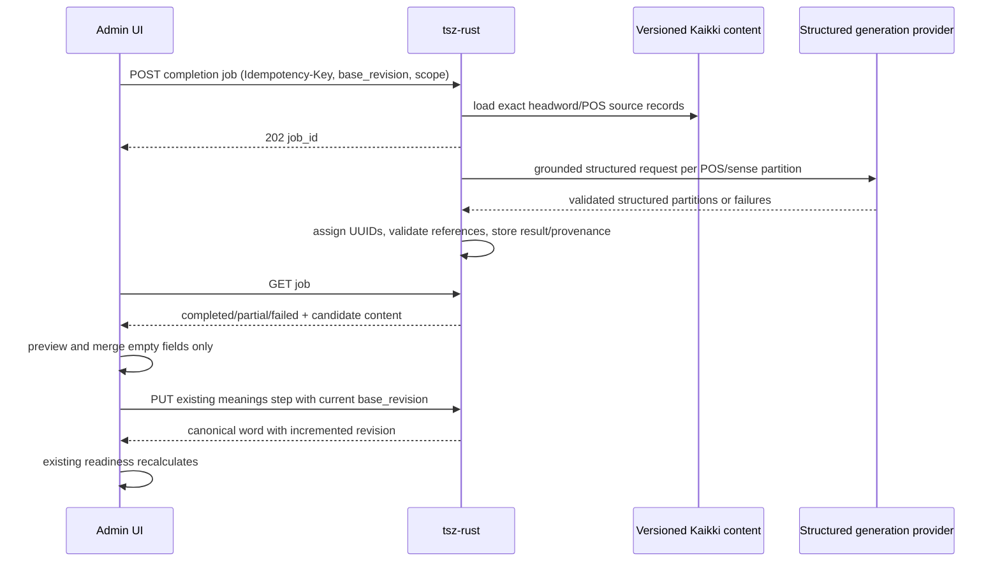

# 词条内容自动生成与安全回填技术设计

## 评估结论

该功能必须前后端共同修改，且后端先行。当前内置词典的数据形状不足以生成目标内容，不能只增加前端按钮，也不能复用 `suggested_meanings` 的空占位冒充生成结果。

推荐实现为“异步生成任务 + 只读候选结果 + 前端本地安全合并 + 现有保存接口”。后端先扩展版本化 Kaikki 内容数据、接入真实结构化生成提供方并发布 OpenAPI；前端随后由 OpenAPI 同步契约，轮询任务、预览字段来源，按空缺合并到现有 `DraftMeaningsStepContent`，最终仍调用 `saveMeaningsStep`。

## 已核对的真实能力

### Rust 后端

- `docs/openapi.json`：不存在 generation/completion path；已有 `PUT /entries/{id}/steps/meanings`、revision 保存和校验契约。
- `migrations/20260802203000_create_dictionary.up.sql`：`dictionary.terms` 只有词头、kind、POS、sense 数量和地区摘要；`region_*` 只有地区/拼写/别名证据。
- `docs/dictionary-import.md`：当前激活数据版本为 `kaikki-en-2026-07-06-rules-v1`，560,635 个正式词头，但文档未声明内容正文可用。
- `src/lexicon/service/entry.rs`：`build_initial_meanings` 为每个 POS 构造空语法、一个 A1 空中文释义和一个 A1 空例句；这只是编辑骨架。
- `src/lexicon/dto/aggregate.rs`：目标树已经支持 `grammar_structure_id`、多 definition、sentence links、统一/英美区分文本和 CEFR 字段，可作为最终回填形状。
- `TextOrigin` 目前只有 `dictionary | converted | manual`，不足以表达“来源提取”和“模型生成”的字段级审计；生成结果应使用独立 provenance，而不是仅扩枚举后把审计信息塞进业务正文。

### 前端

- `packages/types/src/admin-word-v2.ts` 1:1 镜像现有 wire；没有生成任务类型。
- `packages/api-client/src/admin.ts` 与 `apps/admin/.../dataSource.ts` 没有生成方法。
- `packages/api-client/src/openapi.snapshot.json` 由 `scripts/sync-openapi.mjs` 生成，禁止手改。
- `MeaningsAndExamplesStep.tsx` 已维护未保存本地 `content`、dirty guard、方言补全和现有保存语义，适合承载生成入口与回填。
- `model.ts` 已提供稳定 UUID 树和 `toMeaningsWireContent`；新增合并必须保持 `pos_id`、`sense_id`、`grammar_structure_id` 和 sentence focus link 一致。
- `readiness.ts` 与 `WordCreationWizard.tsx` 已能对本地 draft 实时重算，不需要为“生成完成”新增第二套完成状态。

## 方案概述



异步任务避免模型调用占用 HTTP 请求和数据库事务，也自然承载部分成功、重试、幂等和刷新页面后的恢复。候选结果单独持久化，不直接改词条。

## 后端契约建议

### 1. 创建任务

`POST /api/v1/admin/lexicon/entries/{id}/content-completion-jobs`

- Header：`Idempotency-Key: UUID`（必填）。
- Request：

```json
{
  "base_revision": 3,
  "scope": ["grammar_structures", "meanings", "examples"],
  "fill_policy": "missing_only"
}
```

- `202`：返回 `ContentCompletionJobEnvelope`；若已有同幂等任务，返回同一 job。
- `404`：词条不存在；`409`：revision/idempotency 冲突；`422`：归档、无 POS、scope 非法；`429`：并发/配额；`503`：来源或生成提供方未配置/不可用。
- `fill_policy` 首版只允许 `missing_only`。若评审决定支持覆盖，再独立增加 `reviewed_replace`，不能先埋无 UI 约束的覆盖能力。

### 2. 查询任务

`GET /api/v1/admin/lexicon/entries/{id}/content-completion-jobs/{job_id}`

核心响应形状：

```json
{
  "job": {
    "id": "uuid",
    "entry_id": "uuid",
    "base_revision": 3,
    "status": "partial",
    "requested_scope": ["grammar_structures", "meanings", "examples"],
    "partitions": [
      {
        "pos_id": "uuid",
        "pos": "noun",
        "status": "completed",
        "attempt": 1,
        "result": { "...": "typed candidate nodes" },
        "provenance": {
          "dictionary": {
            "provider": "Kaikki English Wiktionary",
            "dataset_version": "...",
            "source_record_keys": ["..."]
          },
          "generation": {
            "provider": "qwen",
            "model": "configured model identifier",
            "prompt_version": "lexicon-content-v1"
          }
        }
      }
    ],
    "created_at": "...",
    "updated_at": "..."
  }
}
```

实际 OpenAPI 拆成封闭 enum/对象，不使用自由形状 `result`。候选结果映射为 `DraftMeaningsStepContent`；每个 POS 分区返回 Kaikki source keys、模型/提示版本、生成时间，以及语法、词义、例句、CEFR 的封闭 `field_origins`。业务保存 DTO 不携带 provider 密钥或内部 prompt。

### 3. 重试失败分区

`POST /api/v1/admin/lexicon/entries/{id}/content-completion-jobs/{job_id}/retries`

- Header：新的 `Idempotency-Key`。
- Request：`pos_ids`；只允许该 job 中 `failed` / `missing` 的分区。
- 返回 `202` 和同一 job 的新 attempt 状态。已完成分区不可被重试覆盖。

### 4. 状态与错误

- Job：`pending | running | completed | partial | failed`。
- Partition：`pending | running | completed | missing | failed`。
- 分区错误建议：`source_not_found`、`provider_not_configured`、`provider_rate_limited`、`provider_timeout`、`provider_safety_rejected`、`invalid_structured_output`、`unsupported_pos`。
- HTTP 基础错误继续用 `application/problem+json`；上游失败作为任务/分区状态返回，不把异步失败伪装成查询接口 500。

## 后端实现设计

### 版本化来源数据

新增 `dictionary.entry_contents` 与 `dictionary.content_imports`，和 `dictionary.datasets` 的不可变版本绑定。前者保存 source record key、规范词头、POS、完整 senses 与原始记录定位；后者保存输入 SHA-256、来源定位、行数和导入时间。导入器支持 `.jsonl` / `.jsonl.gz`、整批事务、期望行数校验和不连数据库的 `--validate-only`。

不改变现有轻量 detection 查询的性能模型。检测继续读 `active_terms`；生成任务按精确词头/POS 查询内容表。官方全量数据由 Kaikki English machine-readable dictionary 下载；当前已用官方单词 JSONL 小样验证输入形状和 SHA-256，完整导入仍必须在明确目标库、版本、记录数和许可要求后单独执行，本功能开发不触碰测试服运行数据。

### 生成提供方

使用窄接口 `LexiconContentGenerator` 隔离 provider。生产实现支持已完成的 OpenAI Responses API 与阿里云百炼千问 OpenAI-compatible Chat Completions API，由 `LEXICON_GENERATOR_PROVIDER=openai|qwen` 显式选择；禁止一次任务内自动切换 provider。测试实现仅用于单元/HTTP 隔离测试。

两个适配器共享同一提示词、输出 JSON Schema、反序列化类型和后置业务校验，但分别构造并解析真实 wire：OpenAI 使用 `/responses` 的 `text.format`，千问使用 `/chat/completions` 的 `response_format={type: json_schema, json_schema: {name, strict, schema}}`。千问仅允许配置官方文档声明支持 JSON Schema 的模型。配置包含 provider、API key、model、base URL 和 timeout，密钥不进入任务、日志或 provenance。

模型输出不能决定数据库 ID。服务端在验证 source key 后生成 UUID 并建立：grammar -> definition 引用、sense -> sentence、sentence focus link。来源没有支持的 POS 或 sense 时返回 `missing`。

### 持久化与任务执行

- 新表建议：`lexicon.content_completion_jobs`、`lexicon.content_completion_partitions`；唯一约束覆盖 `(actor_id, idempotency_key)` 并保存请求摘要，防止同 key 不同 payload。
- 创建任务事务只写 job/partition，不调用外部 provider。
- 后台 worker 领取分区、短事务更新 lease/attempt，外部调用后再短事务落结果。worker 重启后可回收过期 lease。
- 若项目当前没有通用 job runner，首版可在服务进程内运行有界 worker，但数据库状态必须可恢复；不能只 `tokio::spawn` 后把唯一状态留在内存。
- 保存候选时执行结构、CEFR、RichText 边界、POS 所属、引用闭包和数量上限校验。
- retention 需要明确（建议 30 天后清理候选正文，保留最小审计元数据）；本轮不建立长期 prompt 内容仓。

## 安全合并算法

后端候选以 `base_revision + pos_id + source_key` 锚定。前端合并为纯函数，输入当前本地 content、候选 content 和策略，输出：

```ts
{
  content: DraftMeaningsStepContent;
  report: Array<{
    target: string;
    outcome: "applied" | "skipped_existing" | "failed";
    reason?: string;
  }>;
}
```

规则：

1. 当前 word revision 必须等于 job `base_revision`，且页面生成开始后没有本地 dirty 变更；否则禁止批量应用。
2. 只处理当前 forms 中存在的 `pos_id`；未知 POS 结果跳过并报告。
3. 初始化空 sense group/grammar/sense/definition/sentence 可整体替换；任何节点含非空人工字段时保留该节点，仅追加不冲突的候选节点。只有当该词性的现有词义与候选词义各唯一时才做节点内补全；无可靠语义锚点的多词义结果保留人工节点并追加候选，不按数组下标绑定。
4. 候选内部 UUID 冲突、悬空 grammar 引用、错误 sentence focus link 或非法 CEFR 时整个 partition 不应用。
5. 应用后立即调用现有 meanings validation/readiness 纯逻辑；结果仍可能是不完整草稿，UI 如实显示剩余项。
6. 应用只更新 `contentRef`/React state 并标 dirty；保存继续经 `toMeaningsWireContent` 和现有 `saveMeaningsStep`。409 revision 冲突沿用现有刷新/重试交互，绝不自动覆盖。

## 前端代码影响范围

### `@tsz/types`

- `packages/types/src/admin-word-v2.ts`：新增 OpenAPI 对应的 job、partition、scope、provenance、typed candidate 和 retry DTO，保持 snake_case。
- `packages/types/src/index.ts`：导出新增类型。

### `@tsz/api-client`

- `packages/api-client/scripts/sync-openapi.mjs`：将新 path/schema 纳入精简快照名单。
- 先从 Rust `docs/openapi.json` 运行 `pnpm --filter @tsz/api-client sync:openapi`；绝不手改 `openapi.snapshot.json`。
- `packages/api-client/src/admin.ts`：增加 create/get/retry 三个请求；创建/重试透传 `Idempotency-Key`。
- `packages/api-client/src/admin.test.ts` 与契约测试：验证 method/path/header/body 和权威快照。

### `apps/admin`

- `features/dictionary/dataSource.ts`：真实 data source 增加三项能力；正式构建不回退 mock。
- `word-creation/api.ts`：增加创建任务、轮询查询、重试 hooks；轮询只在 pending/running 时启用。
- 新增 `word-creation/contentCompletion.ts`：纯状态归并、安全合并和 report 生成。
- 新增 `word-creation/ContentCompletionPanel.tsx`：触发按钮、范围说明、状态/部分错误、来源审计、应用和重试 UI；当前任务 ID 与生成基线保存在当前浏览器会话，页面重载后可恢复，canonical 词条仍不自动保存。
- `MeaningsAndExamplesStep.tsx`：挂载 panel；生成期间保留当前 content，应用后走统一 `updateContent`，不另建保存通道。
- `word-creation.css`：只添加该 panel 必需样式，继续使用 antd v6，不引入 Tailwind/`@tsz/ui`。
- readiness 代码原则上不改；仅补集成测试证明应用候选后实时联动。

## 两仓交付顺序

1. **tsz-rust 独立分支/PR**：来源数据设计与小样、迁移/导入、provider、job worker、接口、OpenAPI 和后端测试。PR 只到远端评审，不合并、不部署，除非用户后续明确要求。
2. 后端契约稳定后，在前端分支同步 `docs/openapi.json` 生成快照，落 types/api-client/admin UI 与测试，形成独立前端 PR。
3. 两个 PR 均可独立审查；前端 PR 明确依赖后端 PR/契约 SHA。不会用前端 mock 作为完成证据。

## 测试策略（动工阶段先用 test skill 细化矩阵）

### 单元 / mock

- 后端：来源记录映射、多 POS 分区、严格结构解析、UUID/引用闭包、CEFR、方言、数量限制、错误映射、幂等摘要、lease 回收和 partial 聚合。
- provider fake 只验证服务编排，不作为真实生成验收。
- 本次完整评估千问请求 wire、响应解析、配置、错误映射和真实 smoke；OpenAI 保留现有实现与既有测试，不扩展本次测试评估范围。
- 前端：轮询状态机、partial/retry、revision/dirty 阻断、missing-only 合并、人工内容跳过、悬空引用拒绝、readiness 联动。

### HTTP

- 起真实 Rust 服务与测试 PostgreSQL，通过 admin auth 调 create/get/retry；覆盖 202、401/403、404、409、422、429、503 和 problem+json。
- 验证相同 Idempotency-Key 同 payload 复用、不同 payload 冲突；进程重启后任务可继续/恢复。

### 真实数据源

- 使用版本固定、校验和已知的 Kaikki 小样运行导入，核对至少：多 POS、多个 senses、带/不带 example、英美标签、无内容词条。
- 使用真实 provider 凭据对受控词表运行 smoke，记录 provider/model/prompt/dataset 版本、响应状态与成本；凭据和完整响应不入库/不入报告。
- 真实 provider 未获授权或未配置时该层标 `BLOCKED`，不能用 fake 代替 PASS。

### Codex 内置浏览器

- 只使用 Codex 内置浏览器：登录 admin，本地创建/打开草稿，按钮生成，观察 running -> completed/partial，预览 provenance，应用 missing-only，确认人工字段不变、readiness 实时变化、保存后刷新仍存在。
- 模拟 revision 变化、上游失败和失败分区重试。浏览器证据与 HTTP/数据源证据分开报告。

## 风险与权衡

- **内容质量**：Kaikki 结构并不等同产品语义；用 source key、严格 schema、人工审阅和不自动发布降低风险，但不能宣称模型建议是权威事实。
- **中文与 CEFR 来源**：它们主要是模型推断，必须在 UI/provenance 中标明；若禁止外部模型，需求范围必须降级。
- **成本/延迟**：按 POS/sense 分区便于重试但增加请求数；应设置最大 senses/examples、并发与超时，不做无提示的页面自动调用。
- **来源许可与保留**：实现前需确认 Kaikki/Wiktionary 内容的许可、署名和衍生内容展示要求；provenance 设计需支持产品展示。
- **任务基础设施**：数据库可恢复 worker 比单请求复杂，但这是可靠幂等、部分成功和刷新恢复的必要成本；不额外引入通用队列平台。
- **本地未保存内容**：生成期间编辑会使结果基线不可靠；首版建议生成时允许编辑但应用时强校验 dirty/base revision，或 UI 临时禁用应用而非丢弃编辑。

## 回滚

- 后端功能通过配置开关关闭新建任务；已有查询只读保留，现有 detection/save/publish 不受影响。
- 前端隐藏生成入口即可回退，原编辑和保存链路保持不变。
- 新表和内容数据集为旁路对象；回滚应用不删除数据。迁移只新增对象，不修改 canonical 词条结构。

## 评审门

在确认 `requirements.md` 的触发方式、覆盖策略、真实 provider/数据政策及首版范围前，不创建 Rust 实现分支，不修改任何业务代码或测试代码。确认后先实现后端 OpenAPI 与真实链路，再同步前端契约和 UI。
