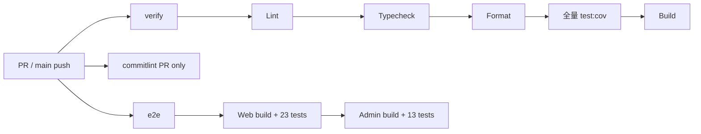
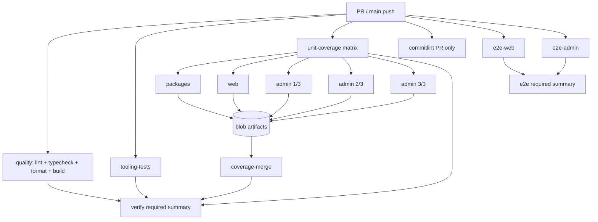
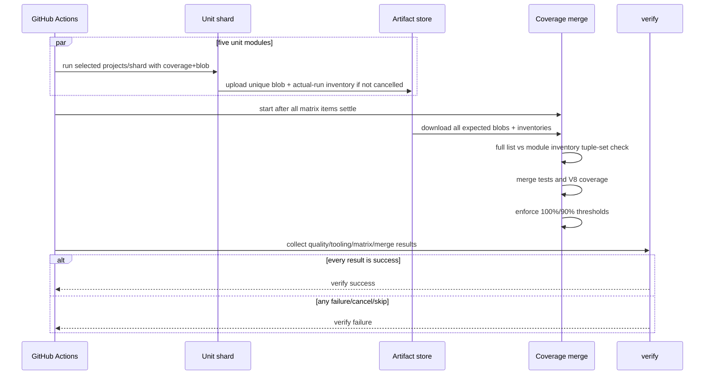

# 前端 CI 模块化并行测试技术设计

## 方案概述

推荐采用“语义模块 + 长尾分片 + 原生报告合并 + 稳定汇总门”的方案：

- 静态质量/构建、工程工具测试、Vitest coverage、web E2E、admin E2E 并行启动；
- Vitest coverage 分为 packages、web、admin 三个语义模块；packages 和 web 各一个任务，admin
  基于当前 75 个文件再使用 `1/3`、`2/3`、`3/3` 三个原生 Vitest shard；
- 五个 coverage 任务均使用 Vitest blob reporter 并上传报告；后置任务下载并用
  `vitest --merge-reports --coverage` 合并，在完整数据上执行现有覆盖率门槛；
- shard 使用专用 coverage config，只收集 coverage、不执行局部 thresholds；完整配置与 shard 配置
  共享同一份 provider/include/exclude，避免策略漂移；
- 每个模块先生成带 projectName 的动态测试 inventory，merge 前与完整 inventory 做精确集合对账；
- `verify` 与 `e2e` 变为 fail-closed 汇总 Job，保留 GitHub ruleset 当前要求的稳定 check 名；
- 本地 `pnpm test:cov` 和 pre-push 不拆分，继续作为单机完整门禁。

Vitest 4 官方支持用 `--shard` + `--reporter=blob` 在多机运行，并在后置阶段用
`--merge-reports --coverage` 合并测试及覆盖率结果；GitHub Actions 官方支持 matrix、`needs` 和
带状态条件的汇总 Job。本方案直接使用已锁定的 Vitest 4.1.11 与现有 Actions 能力，不新增依赖：

- <https://v4.vitest.dev/guide/features#sharding>
- <https://v4.vitest.dev/guide/reporters#blob-reporter>
- <https://docs.github.com/en/actions/how-tos/write-workflows/choose-what-workflows-do/use-jobs>

## 现状与瓶颈

### 当前拓扑



最近 10 次成功 main run 的 `verify` 中位数为 358.5 秒，其中覆盖率步骤中位数 298.5 秒。
最新 run 的 133 个 Vitest 文件分布及日志累计文件耗时为：

| project      | 文件数 | 文件日志累计耗时 | 最长单文件 |
| ------------ | ------ | ---------------- | ---------- |
| admin        | 75     | 331.51 秒        | 84.90 秒   |
| web          | 30     | 25.10 秒         | 3.98 秒    |
| voice-editor | 10     | 15.81 秒         | 10.19 秒   |
| ui           | 3      | 0.50 秒          | 0.24 秒    |
| shared       | 11     | 0.16 秒          | 0.04 秒    |
| api-client   | 4      | 0.13 秒          | 0.07 秒    |

这些是并发 worker 下的文件日志耗时之和，不能直接当作 Job wall-clock；但足以证明 admin 是长尾，
且仅按目录三分不会显著改善关键路径。

### 必须保持的外部契约

通过 GitHub rules API 核对，main 的仓库 ruleset 当前要求以下 status contexts：

- `verify`
- `commitlint`
- `e2e`

部署脚本按 workflow 名 `CI` 判断 exact-main 是否成功，并不读取内部子 Job。因此 workflow 名和
上述三个 required check 名必须稳定；内部可以增加子任务，但不能要求先修改 ruleset 才能合入。

## 目标拓扑



## Job 设计

### 共享 setup

每个执行 Node/pnpm 的 Job 复用相同的显式步骤：

1. `actions/checkout@v7`；
2. `pnpm/action-setup@v6`，版本继续读取根 `packageManager`；
3. `actions/setup-node@v7`，继续读取 `.nvmrc` 并启用 pnpm cache；
4. `pnpm install --frozen-lockfile`。

暂不抽成本地 composite action。当前只有一个 workflow，复制少量 setup 更直观，也避免为单次复用
引入额外抽象。安装在最近 main run 中约 5–7 秒，重复安装换取测试并行是可接受的 wall-clock
取舍；实施后同时记录总 Runner 时间。

### `quality`

执行：

1. restore `.turbo` cache；
2. `pnpm lint`；
3. `pnpm typecheck`；
4. `pnpm format:check`；
5. `pnpm build`。

上述步骤当前合计明显短于覆盖率测试，放在同一 Job 可减少重复安装和缓存竞争。构建仍覆盖 web、
admin 及依赖包，不改 Turbo task 图。

### `tooling-tests`

从当前 `pnpm test:cov` 前置链中完整迁出但不删除：

- `pnpm check:node`
- `pnpm test:node-runtime`
- `pnpm test:coverage-lock`
- `pnpm test:deploy-provenance`

它们不需要 V8 coverage，也不应在五个 coverage Runner 中重复执行。该 Job 的结果进入 `verify`。

### `unit-coverage` matrix

矩阵固定为五项，`fail-fast: false`：

| matrix name | Vitest project 范围                  | shard |
| ----------- | ------------------------------------ | ----- |
| packages    | shared、ui、api-client、voice-editor | 无    |
| web         | web                                  | 无    |
| admin-1     | admin                                | 1/3   |
| admin-2     | admin                                | 2/3   |
| admin-3     | admin                                | 3/3   |

每项使用 `vitest.ci-shard.config.ts`，只改变 `--project` 和可选 `--shard`。该配置与根
`vitest.config.ts` 复用同一份 projects、coverage provider/include/exclude，但有意不配置 thresholds，
并把 `coverage.reporter` 显式设为 `[]`；仅省略 reporter 会触发 Vitest 默认的
text/html/clover/json，仍会让五个 shard 重复生成最终报告。否则 packages 或任一 admin shard 还会
把其他模块视为未覆盖，在 merge 前就以局部覆盖率失败。执行参数的语义等价于：

```text
vitest run --config=vitest.ci-shard.config.ts --coverage --maxWorkers=2 \
  --reporter=blob --reporter=./scripts/ci-test-inventory-reporter.mjs \
  --project=<project> [--shard=i/3]
```

packages 项对四个 package projects 使用重复 `--project` 选项。`scripts/ci-test-modules.mjs` 复用
现有 `buildCoverageVitestArgs()` 生成 `run --coverage --maxWorkers=2`，再追加受控 module 参数；不能
直接拼一条绕过 worker 上限的新 Vitest 命令。既有显式 `--maxWorkers` 覆盖能力保持不变并补参数测试。

Vitest 4.1.11 的 `vitest list --filesOnly --json` 不应用 `--shard`，因此不能用三次 list 结果代表
admin 三个实际分片。每项同时启用 blob reporter 与仓库内的
`scripts/ci-test-inventory-reporter.mjs`。自定义 reporter 在 `onTestRunEnd(testModules)` 读取实际 shard
收到的 `TestModule[]`，把 `testModule.project.name` 与 `testModule.moduleId` 规范化为按
`(projectName, repository-relative filepath)` 排序的 `<module>.inventory.json`；空结果、模块内重复
tuple、仓库外路径均立即失败。它与 blob 在同一次 Vitest 进程中产出，inventory 因而对应实际执行
集合，而不是 shard 前的候选全集。

随后把唯一 blob 与对应 inventory 放进同一个唯一 artifact，`if: !cancelled()` 上传，中间 artifact
保留 1 天并包含隐藏目录。测试失败仍触发 `onTestRunEnd`；若进程崩溃导致 inventory 缺失，则 artifact
或 merge 前置校验失败，最终 `verify` fail closed。

矩阵参数写在 workflow 的固定 include 清单中，不接受 PR 输入。新增 `scripts/ci-test-modules.mjs`
集中定义并验证：

- 合法 module 名和对应 projects；
- 根配置的 6 个 projects 均被覆盖；
- 非 admin project 只出现一次；
- admin shard 分母一致，索引恰好为 `1..N`；
- 输出文件名不重复；
- inventory reporter 与 blob reporter 位于同一次实际 module run；
- coverage 参数保留 `--maxWorkers=2`，且 shard config 不含 thresholds、`coverage.reporter` 明确为 `[]`；
- 未知 module fail closed。

workflow 调用脚本获取受控参数或让脚本直接 spawn Vitest，避免在 YAML 中维护两套容易漂移的参数。
脚本只允许预定义枚举，不执行来自分支、PR body 或文件内容的任意命令。

### `coverage-merge`

依赖完整 `unit-coverage` matrix，并在未被取消时运行：

1. 下载所有 `vitest-blob-*` artifacts，`merge-multiple: true`；
2. 核对 module、artifact、blob、inventory 名称均与 manifest 精确一致；
3. 用根 project 配置执行 `vitest list --filesOnly --json`，动态生成完整权威 inventory；
4. 解析五份 module inventory，拒绝任一重复 tuple，并要求其并集与完整 inventory 在
   `(projectName, repository-relative filepath)` 上完全相等；缺失、额外、重复或 project 错配均失败；
5. 执行 `vitest --config=vitest.config.ts --merge-reports=<dir> --coverage`；
6. 使用根完整配置生成统一文本/HTML报告，并执行原有路径阈值：
   packages 100%、web 90%、admin 90%；
7. 输出动态测试文件总数、各 project 文件数与 coverage summary；失败时上传 HTML 报告 7 天。

Vitest blob 包含测试结果和 coverage 数据，merge 阶段由 coverage provider 合并。阈值只在完整结果上
作最终裁决；shard config 明确移除 thresholds，单个 shard 的职责仅是测试执行与 coverage 收集。
当前 133 仅作为本轮对照数据，脚本不得把它写死为未来门槛。

若任一测试失败，分片仍在未取消时上传 blob；merge 可输出统一失败结果。即使 merge 因缺 artifact
无法执行，最终 `verify` 仍同时检查 matrix 与 merge 的结果，不会因下游 skipped 而误绿。

### `verify` 稳定汇总门

`verify` 使用 `if: always()` 等待：

- `quality`
- `tooling-tests`
- `unit-coverage`
- `coverage-merge`

汇总步骤只在全部结果为 `success` 时成功；`failure`、`cancelled`、`skipped` 均 fail closed。它本身不
重复跑测试，职责是维持 GitHub required context `verify` 并将内部多 Job 结果收敛为稳定门禁。

### web/admin E2E 与 `e2e` 汇总

把当前 `pnpm test:e2e` 的串行链拆为：

- `e2e-web`：浏览器准备后执行 `pnpm --filter @tsz/e2e test:e2e:web`；
- `e2e-admin`：浏览器准备后执行 `pnpm --filter @tsz/e2e test:e2e:admin`；
- `e2e`：`if: always()` 汇总两者，任一非 success 即失败。

两端分别上传 `playwright-report` 与 `playwright-report-admin`，artifact 名不冲突。现有 Chromium
cache、system deps 限时重试、trace/screenshot 和失败报告语义保持不变。两端都需浏览器环境，首版
接受 setup 重复换取约 30 秒的关键路径下降；暂不设计共享已启动服务或跨 Job 复用进程。

### `commitlint`

保持现状：只在 pull request 运行，完整 checkout 后校验 base..head。Job id/name 继续为
`commitlint`，不参与 `verify` 或 `e2e` 汇总。

## 代码影响范围

### 修改

- `.github/workflows/ci.yml`
  - 重排上述 Job 拓扑；
  - 增加 unit coverage matrix、blob artifact、coverage merge 和稳定 summary；
  - 拆分 web/admin E2E；
  - 保留 workflow 名、permissions、concurrency、commitlint 和 required check 名。
- `package.json`
  - 增加明确的 CI module/merge/workflow-contract 测试入口；
  - 保留现有 `test:cov` 字节语义或仅通过已有脚本复用，不改变 lefthook 调用。
- `vitest.config.ts`
  - 从单一共享模块导入 projects、coverage provider/include/exclude/reporters/thresholds；
  - 重构前后完整配置语义和 `pnpm test:cov` 结果不变。

### 新增

- `scripts/ci-test-modules.mjs`
  - 固定模块 manifest、参数生成、inventory 生成/对账和受控 Vitest 执行入口；
  - 复用 `buildCoverageVitestArgs()`，保留 `--maxWorkers=2`。
- `scripts/ci-test-inventory-reporter.mjs`
  - 从同一次实际 shard run 的 `onTestRunEnd(TestModule[])` 生成 project/path tuple inventory；
  - 拒绝空集合、重复 tuple、仓库外路径和缺失 module 环境参数。
- `scripts/ci-test-modules.test.mjs`
  - 模块枚举、project 完整性、admin shard 连续性、worker 参数、inventory 集合、未知模块、唯一
    artifact 等单测。
- `vitest.shared-config.ts`
  - 单一来源导出 projects、coverage provider/include/exclude，以及仅完整门使用的 reporters/thresholds。
- `vitest.ci-shard.config.ts`
  - 复用共享 projects 与 coverage 收集策略，不配置 thresholds，并显式设置 `coverage.reporter: []`。
- `scripts/ci-workflow.test.mjs`
  - 对 workflow 的稳定 Job、依赖图、fail-fast、artifact、coverage merge、触发器和权限做结构回归。

### 不修改

- `apps/**/src`、`packages/**/src` 业务与现有测试断言；
- 根 `vitest.config.ts` 的 include/exclude/thresholds 数值与生效范围；允许只为单一来源做等价抽取；
- `scripts/run-coverage-locked.mjs`、`buildCoverageVitestArgs()`、coverage lock 与 lefthook pre-push 语义；
- Playwright 用例和现有 web/admin config 的业务行为；
- `deploy/**`、OpenAPI、后端仓库和数据库。

完整配置和 shard 配置必须从单一模块导出共享常量；不得复制并漂移 coverage include/exclude。shard
移除 thresholds 是明确的阶段差异，不是降低最终门槛；merge 仍使用根完整配置的原 thresholds。

## 数据流与失败传播



## 测试策略与矩阵

实施阶段先使用 `test` skill 固化矩阵，再写 workflow。最低测试集如下：

| ID  | 层级          | 场景                                      | 预期                                          |
| --- | ------------- | ----------------------------------------- | --------------------------------------------- |
| M01 | Node 单元     | 合法五项 module manifest                  | 6 projects 完整覆盖                           |
| M02 | Node 单元     | admin `1/3..3/3`                          | 分母一致、索引连续                            |
| M03 | Node 单元     | project 重复、缺失、未知 module           | fail closed                                   |
| M04 | Node 单元     | artifact/blob 名称                        | 全部唯一且无路径穿越                          |
| M05 | Node 单元     | coverage module 参数                      | 默认包含 `--maxWorkers=2`                     |
| M06 | Node 单元     | shard 与 root coverage config             | 同源；shard 无 thresholds 且 reporter 为 `[]` |
| M07 | Node 单元     | 实际 shard reporter inventory             | tuple 来自 `TestModule[]`，不是 pre-run list  |
| M08 | Node 单元     | full/module inventory 集合                | tuple 无遗漏、额外或重复                      |
| W01 | workflow 结构 | workflow 名、PR/main trigger、permissions | 与现状一致                                    |
| W02 | workflow 结构 | matrix `fail-fast: false`                 | 所有模块可继续运行                            |
| W03 | workflow 结构 | coverage merge 依赖完整 matrix            | 缺报告不能成功                                |
| W04 | workflow 结构 | `verify` required summary                 | 任一前置非 success 即失败                     |
| W05 | workflow 结构 | `e2e-web`、`e2e-admin`、`e2e` summary     | 双端并行且失败收敛                            |
| W06 | workflow 结构 | `commitlint` PR-only                      | 行为不变                                      |
| C01 | 本地集成      | 五个 coverage module 依次运行             | 局部阈值不误杀；测试通过并产 blob/inventory   |
| C02 | 本地集成      | 合并五个 blobs                            | 动态 full inventory 无遗漏/重复；本轮为 133   |
| C03 | 覆盖率        | 合并后执行根阈值                          | packages 100%、web/admin 90%                  |
| C04 | 负向集成      | 删除/重复/错配 blob 或 inventory          | tuple 集合对账或 merge 失败                   |
| C05 | 本地集成      | admin 三个实际 shard inventories          | 三者互斥，并集等于完整 75 文件                |
| Q01 | 原生质量门    | `pnpm test:cov`                           | 原单机完整门仍通过                            |
| Q02 | 原生质量门    | lint/typecheck/format/build               | 全部通过                                      |
| E01 | Playwright    | web suite                                 | 当前 23 场景通过                              |
| E02 | Playwright    | admin suite                               | 当前 13 场景通过                              |
| G01 | 真实 PR CI    | 所有内部 Job 与 required summaries        | checks 正确、无 pending 死锁                  |
| G02 | 真实失败演练  | 临时测试分支制造一个模块失败              | 该模块失败，其他模块继续，summary 失败        |
| G03 | 真实 main CI  | 合并后的 exact SHA                        | workflow completed/success，部署门可识别      |
| P01 | 性能观测      | 至少 3 次 warm-cache run                  | 关键路径中位数 ≤ 4 分钟                       |

真实失败演练只在施工分支使用可回退的临时提交或 workflow dispatch 验证，最终交付 commit 不保留故障代码。

## 备选方案

### 方案 A：仅拆 packages / web / admin

优点是最简单；缺点是 admin 75 个文件、累计日志耗时 331.51 秒，仍接近现有 298.5 秒覆盖率步骤，
预期加速很小。否决。

### 方案 B：全套测试任意四等分

直接对全部 133 文件使用 `1/4..4/4`，实现最少且可能最快；但 Job 无法表达业务模块，packages、
web、admin 失败混在同一 shard，维护者定位成本更高，也不符合“按模块拆分”的目标。否决。

### 方案 C：自研按历史耗时的文件清单

可把大文件精确配平，但每次新增/重命名测试都要维护分类器，历史耗时也会漂移；容易出现清单漏测。
本期只固定语义 project 边界，admin 内部交给 Vitest 原生 shard 自动覆盖。否决。

### 方案 D：Changed-files 增量 CI

能进一步节省 Runner，但 monorepo 依赖传播、共享包影响和部署工具变化需要可靠依赖图；误判会直接漏测。
本期坚持每次完整执行，未来另立需求评估。否决。

## 风险与缓解

| 风险                                        | 影响                              | 缓解                                                                |
| ------------------------------------------- | --------------------------------- | ------------------------------------------------------------------- |
| shard 局部 thresholds 或默认 reporter       | 矩阵误红或重复报告                | 无 thresholds 且 `coverage.reporter: []`；merge 才报告；M06/C01     |
| coverage blob 合并与当前 project 配置不兼容 | 阈值错误或报告缺失                | 先做本地五 blob→merge 原型；锁定 Vitest 版本；C01–C04 回归          |
| 新执行器遗漏 worker 上限                    | 渲染密集测试抖动                  | 复用 `buildCoverageVitestArgs()`；M05 固定 `--maxWorkers=2`         |
| pre-run list 不应用 shard                   | 三个 admin inventory 全量重复     | 实际 run 的 custom reporter 产 inventory；M07/C05                   |
| blob 数量正确但内容重复                     | 漏测仍可能假绿                    | 动态 full inventory 与五份 module tuple 集合精确对账；M08/C04       |
| admin 原生 shard 不均衡                     | 仍有长尾                          | 先用 3 shard；以真实 Actions 时长调整，不维护静态文件清单           |
| matrix 某项失败导致 merge skipped           | required check 假绿或永久 pending | `if: !cancelled()` + 最终 `verify if: always()` 双重 fail closed    |
| required check 改名                         | ruleset 阻止合并                  | 保留 `verify`/`commitlint`/`e2e` 汇总 Job；真实 PR 核对 contexts    |
| artifact 名冲突或隐藏文件未上传             | merge 缺报告                      | 唯一名校验、`include-hidden-files: true`、数量校验                  |
| 并行增加 Runner 总时长                      | 资源成本上升                      | packages 合并为一项；同时记录 wall-clock 与总 Job 时间              |
| E2E 重复安装/系统依赖波动                   | 总 Runner 时间增加                | 保留 cache 和限时重试；不把外部 apt 故障算作测试变慢                |
| 本地与 CI 命令漂移                          | 本地绿、CI 红                     | 保留 `pnpm test:cov` canonical gate；模块脚本有单测和全量等价性回归 |

## 发布、回滚与观察

1. 在独立功能分支完成脚本、workflow 与测试；不修改 GitHub ruleset。
2. PR 首次运行确认所有内部 Job 实际并行、required contexts 正确出现、覆盖率合并数与原基线一致。
3. 合入后观察至少 3 次有效 warm-cache PR/main run，记录关键路径、各 Job duration、queue time 和总
   Runner time。
4. 若正确性通过但 4 分钟目标未达到，先基于 admin shard 实测调整 2/3/4；不降低门槛。
5. 若出现漏测、覆盖率错误或 required check 卡死，回滚 workflow 与新增 CI 脚本即可；业务代码、
   测试内容、部署配置均未改变，无数据迁移和运行时功能开关。

## 工作分解、负责人建议与估算

| 工作                                  | 建议负责人     | 难度 | 估算                |
| ------------------------------------- | -------------- | ---- | ------------------- |
| module manifest、inventory 与参数校验 | 前端/工程化    | 中   | 0.25–0.5 天         |
| Vitest blob + coverage merge 原型     | 前端/工程化    | 中高 | 0.25–0.5 天         |
| GitHub Actions 拓扑与稳定 summaries   | 前端/工程化    | 中高 | 0.25–0.5 天         |
| Node/workflow 回归与本地全量门        | 前端 + 兼职 QA | 中   | 0.25–0.5 天         |
| PR/main 真实 CI、失败演练和性能记录   | 前端 + 兼职 QA | 中   | 0.25 天外加 CI 等待 |

完整实施预计 1–2 个工作日，主要不确定性是当前 Vitest multi-project coverage blob 在五路选择性
project + admin shard 组合下的合并行为，以及 GitHub Runner 实际排队。若本地原型发现该组合不稳定，
回退为“全套 4-way 原生 shard + 稳定汇总”可控制在同一周期，但需重新提交设计评审，因为其模块
可读性与当前批准目标不同。
