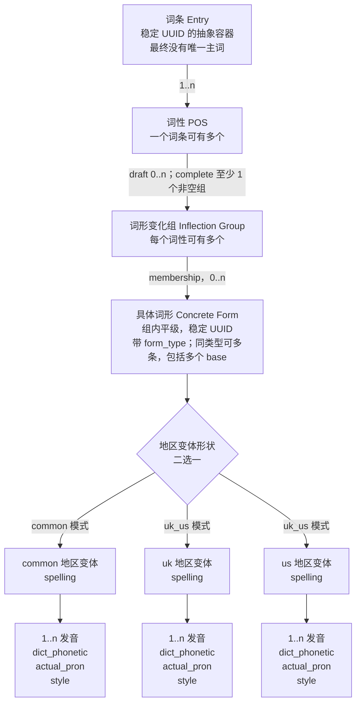

# 智能词库 V3 数据模型技术设计

> 文档状态：Phase 1 推荐决策包已批准；后端 C2 已进入正式 OpenAPI 并据用户确认完成部署，前端 V3 Admin editor、unit/integration 与 Mock E2E 已实现。
>
> 初始评估基线：前端 checkout `296579c6c2d5`，2026-08-23。
>
> 当前核验基线：本次前端 feature worktree；后端 `main@4178ebe`，2026-08-25。
>
> 重要声明：当前正式 OpenAPI 中的 endpoint、wire、错误码与 capability gate，以及 V3 Admin UI 自动化均已实现；这不表示真实 HTTP、PostgreSQL、测试服浏览器、capability flags 或迁移已经验收/启用。

## 设计结论摘要

推荐把 V3 的“具体词形”提升为词性下的稳定实体，把变化组建模为对具体词形的 membership。`base`、`comparative`、`superlative` 等仅是 `form_type`，没有 `base_form` 特殊父节点，也不限制同类型数量。每个具体词形内部使用严格判别联合保存 common，或完整 uk+us 地区变体；发音挂在地区变体下。

完整目标不应继续存在领域级唯一主词，但不能在第一阶段直接删除 `headwords`。推荐分两段：

1. 先落地 V3 词形模型、版本化读写与 Admin 编辑，保留受控的主词兼容桥；
2. 等展示名称、重复策略、surface、搜索、关联词与学习端均切到新投影后，再单独取消主词。

历史 V2 publication 保持不可变，由双版本 reader 读取。V3 一旦保存多个 `base` 等 V2 无法表达的结构，不允许有损降级回写 V2；回滚采用关闭 V3 写入、保留只读和前向修复。

Phase 1 中会改变 wire/迁移骨架的推荐值已经批准；最终展示策略、重复政策、例句命中证据和 Phase 2/3 消费者切换仍按本文的延后边界另行评审。后端 C2 已进入当前正式 OpenAPI；真实成功路径、数据库状态与 flags 是否可用仍必须由独立真实环境证据确认。

## 约束与假设

- 词条 entry UUID 是长期身份，不由任何拼写生成，也不随拼写变化。
- V3 最终没有唯一主词、唯一原型或原型派生树。
- common/uk/us 是同一个具体词形下的地区变体，不是独立 entry。
- `@tsz/types` 继续 1:1 镜像 snake_case wire，不引入 HTTP 命名转换层。
- `tsz-rust/docs/openapi.json` 仍是权威契约；当前 `main@4178ebe` OpenAPI SHA-256 为 `460535d2de2d9335fb1680ce86d65978085e42d5b50aea74f16431612e44c3e0`，前端只通过 `pnpm --filter @tsz/api-client sync:openapi` 同步，绝不手改 snapshot。
- Admin 使用 antd v6，不引入 tailwind 或 `@tsz/ui`。
- 草稿与完成语义继续分离：draft 可不完整，complete/publish 由后端权威校验。
- 本文只读取公开契约与前端实现事实，没有把后端内部表名或实现细节当成已确认事实。

## Phase 1 已批准决策包

用户于 2026-08-24 回复“按推荐方案批准，进入契约施工”。以下 A 类值与 B/C 类中性延后行为已冻结为 Phase 1 输入，并已进入当前 C2 正式 OpenAPI；这不表示真实 HTTP、数据库或 flags 已通过验收。

| 类别 | 决策  | Phase 1 推荐值                                                                                                                                                                                                           | 推进边界                     |
| ---- | ----- | ------------------------------------------------------------------------------------------------------------------------------------------------------------------------------------------------------------------------ | ---------------------------- |
| A    | scope | V3 首期仅 `kind=word`；phrase 保持 V2                                                                                                                                                                                    | 批准后才可冻结 aggregate     |
| A    | Q1    | 同一 POS 内允许一个 form 属于多个 group；group 只持稳定 membership，禁止跨 POS、同组重复 membership                                                                                                                      | 决定 form/group identity     |
| A    | Q2    | 地区模式只属于 concrete form；canonical 为 common xor uk+us，POS/group 不存继承规则                                                                                                                                      | 决定 region wire             |
| A    | Q7    | 历史 V2 publication 原样不可变、双版本 reader；V3-only 只前滚                                                                                                                                                            | 决定 reader/rollback         |
| A    | Q8    | draft 可零/空 group；complete 每 POS 至少一个 group 且所有保留 group 非空；任何 form 至少一个 membership；最后 membership 与 form 同事务退役/删除或拒绝                                                                  | 决定 orphan/完成校验         |
| A    | Q9    | `form_type` 使用版本化固定枚举，不允许自由文本                                                                                                                                                                           | 决定 enum/catalog            |
| A    | Q10   | wire 数组顺序是唯一权威，不同时暴露 `sort_order`；数据库可内部存 ordinal                                                                                                                                                 | 决定排序 wire                |
| A    | Q12   | 迁移时一次性复制原 V2 headwords 为 response-only bridge，不提供写 API/持续同步，可进入受控 Phase 1 publish canary；新 V3 不填/不猜 legacy headwords，Phase 2 消费者就绪前只允许 draft/preview/shadow，不激活 publication | 决定兼容桥与发布 gate        |
| B    | Q4    | 结构允许同拼写多 entry/form；Phase 1 继承现有 warning + acknowledgement/policy gate，不建全局唯一约束                                                                                                                    | 最终重复政策可延后 Phase 2   |
| B    | Q5a   | Phase 1 sense 继续只归属 POS，不给 meanings 增加可选 group/form 字段                                                                                                                                                     | meanings 可复用现有 POS 结构 |
| B    | Q5b   | sentence 的 form/variant 命中证据单独设计，不反推 sense ownership                                                                                                                                                        | 留在例句/Phase 2 契约        |
| B    | Q6    | V2 base 保留一个 form UUID，并给每个既有 group 建确定性 membership，不复制 concrete form；实际写迁移仍等待 C1、dry-run 与迁移门                                                                                          | 语义已批准，执行仍 BLOCKED   |
| B    | Q11   | 完整发音三元组规范化后完全相同则拒绝；不完整 draft 行不参与重复判断                                                                                                                                                      | 规则已批准，C1 固化错误码    |
| C    | Q3    | 最终 display strategy Phase 2 冻结；Phase 1 只使用下文的临时 response-only presentation                                                                                                                                  | 不影响 entry/form identity   |

此外，Phase 1 延续当前“同一 entry 内 POS code 唯一”；`is_regular` 仅为 V2 无损迁移暂留 group 元数据，不表达 base/derived 父子关系。若产品不需要该元数据，应在正式 OpenAPI 冻结前删除，而不是上线后再迁移。

## 当前模型与目标模型差异

| 维度        | 当前 V2 事实                                                                | V3 目标                                                      | 直接影响                                |
| ----------- | --------------------------------------------------------------------------- | ------------------------------------------------------------ | --------------------------------------- |
| 词条身份    | `AdminWordV2.id` + 词条级 `headwords`                                       | entry UUID 是抽象容器，最终无唯一主词                        | 列表、搜索、关联、审计需要展示投影      |
| 词性词形    | 每个 `WordPosFormsV2` 强制一个 `base_form`                                  | 每个词性下多个变化组与多个具体词形                           | V2 DTO 不能原位扩展表达                 |
| 变化组      | `WordFormGroupV2.slots` 只含 derived slots                                  | 组内所有具体词形平级，包括多个 `base`                        | 需取消 base 的结构特权                  |
| 类型数量    | base 唯一；现有 UI/校验倾向组内类型唯一                                     | 同一 `form_type` 可有多条                                    | 校验、React key、错误定位要按 UUID      |
| 地区结构    | POS 级 `dialect_rules` + slot `variants[]`                                  | 每个具体词形为 common 或完整 uk+us                           | 已批准 Q2：规则只属于 concrete form     |
| 拼写绑定    | `base_form` 拼写必须等于 `headwords`                                        | 具体词形拼写独立，不绑定主词                                 | 移除 `headwordConsistencyIssues` 类约束 |
| 词义归属    | `WordPosMeaningsV2` 只通过 `pos_id` 归属词性                                | Phase 1 保持 POS ownership；group/form 所有权留到 Phase 2    | 不用可选字段预埋延后设计                |
| publication | 当前存在版本化不可变发布语义                                                | V2/V3 publication 各自按版本读取                             | 已批准不重写历史 V2 快照                |
| surface     | 候选/来源区分 headword 与 form                                              | V3 以 form variant 为事实源，展示标签只作投影                | 分类、查重、token、索引需版本化         |
| 关联词      | 保存 entry/sense，读取 `target_headword` 快照                               | 保存稳定 entry/sense，可选 form；读取 display projection     | `target_headword` 需兼容与改名策略      |
| 例句词形    | 正式 V2 只读投影使用 `target_form_slot_id`                                  | 使用稳定 `form_id/variant_id`；group membership 不作词面身份 | resolver、写入与 publication ref 需适配 |
| TTS         | `/speech/previews` 返回有时效 `audio_url`；canonical pronunciation 不存 URL | 按 variant/pronunciation UUID 消费，仍不持久化临时 URL       | 缓存失效与控件 key 调整                 |
| schema      | 正式 OpenAPI/前端类型为 V2                                                  | V2/V3 判别联合                                               | 路由、runtime guard、契约测试全部受影响 |

## 目标数据模型



图中的 `group → form` 是包含/membership 关系。已批准 Q1 允许同一 POS 内的具体词形通过不同 membership 被多个组包含，同时禁止跨 POS 和同组重复 membership。具体词形不是“英式词条/美式词条”，uk/us 只在该具体词形内部产生两个地区变体。

## V3 wire contract（C1 已冻结）

### 为什么采用“POS 拥有 forms，group 保存 membership”

推荐骨架不把 form 对象直接深嵌并复制在每个 group 中，而是由 POS 拥有稳定 forms，group 通过 form UUID 建立 membership：

- 同一个 `form_id` 可在同一 POS 内被多个 membership 引用，不复制内容。
- 后端禁止跨 POS membership，并以 `(group_id, form_id)` 唯一性禁止同组重复 membership。
- 例句、surface、TTS、词义若需要引用具体词形，统一引用 `form_id`，不引用组内数组下标。
- 组内排序属于 membership，具体词形本身可有独立稳定身份。

该 membership 骨架已经作为 Phase 1 决议批准。后文嵌套单归属方案保留为评审记录，但未采用，不得在 C1 中重新切回而不经过变更评审。

### 类型草案

以下展示批准时的 snake_case 骨架；字段名和 required/nullable 的最终权威以当前正式 OpenAPI 及生成的 `@tsz/types` 为准，示意代码不替代生成契约。

```ts
export type WordFormTypeV3 =
  | "base"
  | "third_person_singular"
  | "present_participle"
  | "past_tense"
  | "past_participle"
  | "plural"
  | "comparative"
  | "superlative";

export interface WordPronunciationV3 {
  id: string;
  dict_phonetic: string;
  actual_pron: string;
  style: PronunciationStyle;
}

export interface WordFormVariantV3<D extends "common" | "uk" | "us"> {
  id: string;
  dialect: D;
  spelling: string;
  origin: "dictionary" | "converted" | "manual";
  pronunciations: WordPronunciationV3[];
}

export type WordRegionalVariantsV3 =
  | {
      mode: "common";
      common: WordFormVariantV3<"common">;
    }
  | {
      mode: "uk_us";
      uk: WordFormVariantV3<"uk">;
      us: WordFormVariantV3<"us">;
    };

export interface WordConcreteFormV3 {
  id: string;
  form_type: WordFormTypeV3;
  regional_variants: WordRegionalVariantsV3;
}

export interface WordFormGroupMemberV3 {
  id: string;
  form_id: string;
}

export interface WordFormGroupV3 {
  id: string;
  is_regular: boolean;
  members: WordFormGroupMemberV3[];
}

export interface WordPosFormsV3 {
  pos_id: string;
  pos: WordPosTag;
  forms: WordConcreteFormV3[];
  form_groups: WordFormGroupV3[];
}

export interface DraftFormsStepContentV3 {
  pos: WordPosFormsV3[];
}
```

关键语义：

- 不存在 `base_form` 字段，也不存在 `derived_from_form_id`、`parent_form_id` 或唯一 `base` 约束。
- `form_type` 允许重复；form UUID 才是节点身份。
- Q9 已批准使用版本化固定枚举且不允许自由文本；上述示意不替代当前正式 OpenAPI 已固化的 `WordFormTypeV3` 枚举。
- `regional_variants` 的判别联合使 common 与 uk+us 互斥，并保证 uk/us 成对。
- `WordFormGroupMemberV3.id` 是 membership 身份；同一 form 跨组时，各 membership 可有不同顺序。
- 推荐按 Q10 让 `forms`、`form_groups`、`members` 与 `pronunciations` 的数组顺序成为唯一 wire 顺序；数据库内部 ordinal 不回传为第二权威字段。
- `is_regular` 按已批准方案仅作为 V2 无损迁移元数据暂留，不表达 base/derived 父子关系；若 C1 要省略，必须作为显式契约变更重新评审。
- draft 可有零 group/空 group，但 `forms[]` 中任何已保存 form 都必须至少被一个 membership 引用；complete/publish 要求每个 POS 至少一个 group，且所有保留 group 都非空。
- 删除 form 的最后 membership 必须在同一命令/事务中显式删除或退役 form，否则返回 `form_reference_conflict`；服务端不能保留 orphan，也不能自动选择其他 group。
- 无派生 POS 的完成态使用一个 base-only group；一个或多个 `form_type=base` 都合法。

### 聚合 envelope 草案

```ts
export interface EntryPresentationV3 {
  /** 服务端只读展示投影，不是主词，不可作为身份或查重键。 */
  label: string;
  matched_surfaces: string[];
  strategy_version: string;
}

export interface AdminWordV3 {
  schema_version: 3;
  id: string;
  language: "en";
  /** Phase 1 only；phrase 继续使用 V2。 */
  kind: "word";
  status: "draft" | "published" | "archived";
  revision: number;
  lifecycle_revision: number;
  presentation: EntryPresentationV3;
  forms: DraftFormsStepContentV3;
  /** Phase 1 继续让 sense 只归属 pos_id。 */
  meanings: DraftMeaningsStepContent;
  compatibility?: {
    /** Phase 1 only；不是 V3 权威语义。 */
    legacy_headwords: WordHeadwordsV2;
  };
  completed_steps: PersistedWordStep[];
  max_reachable_step: WordCreationStep;
  created_by: string;
  created_at: string;
  updated_at: string;
  published_revision?: number;
  has_unpublished_changes: boolean;
  published_at?: string;
}

export type AdminWordAnyEnvelope =
  { word: AdminWordV2 } | { word: AdminWordV3 };
```

Phase 1 临时规则 proposal：

1. `presentation` 只由服务端返回，不接受客户端写入。迁移 entry 的 label 继续格式化原 V2 legacy headwords；新 V3 draft 使用“去重后的地区 surface 摘要”，没有任何 surface 时使用 `未命名词条 · <short_uuid>`。`strategy_version` 固定记录算法版本。该 label 不是主词、ID 或查重键，Phase 2 可在保持 response shape 的前提下替换算法。
2. `meanings` 复用当前 POS/sense 结构，Phase 1 不新增可选 `group_id/form_id`。Q5a 若未来改变 sense ownership，必须另做契约版本评审。
3. 例句命中的 `form_id/variant_id` 属于独立 Q5b，不放进 Phase 1 meanings 保存输入，也不由前端 mock 冒充正式 wire。
4. `compatibility.legacy_headwords` 仅用于迁移 entry 的 response-only bridge，由迁移事务从 V2 一次性复制，之后无写 API、无持续同步。带该 bridge 的迁移 entry 可进入受控 Phase 1 publish canary；新 V3 entry 不填写、不从 first base 推导，在 Phase 2 消费者就绪前只允许 draft/preview/shadow，不激活 publication。

### JSON 示例

```json
{
  "schema_version": 3,
  "id": "d52a0c7d-41c9-4e4c-b25d-1ea1f5678420",
  "forms": {
    "pos": [
      {
        "pos_id": "ee2b61ac-ccfe-4c08-93e4-21bedbb802d8",
        "pos": "adjective",
        "forms": [
          {
            "id": "068fc7cf-3e32-45f0-bbe1-eae3a37037b4",
            "form_type": "base",
            "regional_variants": {
              "mode": "uk_us",
              "uk": {
                "id": "19423384-1068-48e0-aa21-e6d3b29cb0de",
                "dialect": "uk",
                "spelling": "example",
                "origin": "manual",
                "pronunciations": [
                  {
                    "id": "b91690ec-8c22-407d-b3d6-bda2f6d30388",
                    "dict_phonetic": "/example/",
                    "actual_pron": "example",
                    "style": "normal"
                  }
                ]
              },
              "us": {
                "id": "bf8b6522-8371-4823-b03d-2f405010ad2d",
                "dialect": "us",
                "spelling": "example",
                "origin": "manual",
                "pronunciations": [
                  {
                    "id": "4a5efdf9-05df-4995-90ea-849f4a87ac5e",
                    "dict_phonetic": "/example/",
                    "actual_pron": "example",
                    "style": "normal"
                  }
                ]
              }
            }
          },
          {
            "id": "f26be20c-17af-4304-89fb-aecf3d4649a8",
            "form_type": "base",
            "regional_variants": {
              "mode": "common",
              "common": {
                "id": "d41b6ea8-e3eb-49bc-8009-d6aef30f2725",
                "dialect": "common",
                "spelling": "alternate",
                "origin": "manual",
                "pronunciations": [
                  {
                    "id": "e4b18e72-b00a-46f3-9316-5c288aedb8e8",
                    "dict_phonetic": "/alternate/",
                    "actual_pron": "alternate",
                    "style": "normal"
                  }
                ]
              }
            }
          }
        ],
        "form_groups": [
          {
            "id": "56bd9900-3e4d-44c0-ad02-c867f9599964",
            "is_regular": false,
            "members": [
              {
                "id": "9154606a-24a0-43b8-aaad-b4b11a765802",
                "form_id": "068fc7cf-3e32-45f0-bbe1-eae3a37037b4"
              },
              {
                "id": "c6c4f117-5ab4-431c-909e-f5f920de4a78",
                "form_id": "f26be20c-17af-4304-89fb-aecf3d4649a8"
              }
            ]
          }
        ]
      }
    ]
  }
}
```

示例中的两个 `base` 是同一词性、同一变化组里的两个平级具体词形；uk/us 是第一个具体词形内的地区变体。示例拼写和 `style` 只用于表达结构，不是产品词典内容或最终枚举批准。

## wire 备选方案

### 备选 A：group 深嵌 forms，单归属

```ts
interface WordFormGroupV3Nested {
  id: string;
  forms: WordConcreteFormV3[];
}
```

优点是 payload 与 UI 结构直接对应，前端处理最简单；缺点是无法表达已批准的一形多组，只能复制 form 或再次破坏契约，例句和 surface 引用也必须处理重复对象。因此 Phase 1 未采用该方案。

### 备选 B：继续保留 POS 级 `base_form`

拒绝。它无法表达多个原型平级归组，并继续暗示其他词形由唯一 base 派生，与明确目标冲突。

### 备选 C：把 uk/us 建成两个 concrete form 或两个 entry

拒绝。uk/us 是同一具体词形下的地区变体；拆分会破坏 identity、关联、查重和 UI 语义。

### 备选 D：一个通用 JSONB document，不建结构化节点

可用于快速保存，但不推荐作为权威存储：UUID 所有权、跨 publication 引用、surface 索引、删除保护和迁移对账都需要结构化投影，最终会形成双事实源。若后端现状必须保留 document，应让结构化 projection 与引用表成为事务内/可靠 outbox 管理的查询事实，并有强 parity 检查。

## 后端 API：C2 正式契约与真实验收边界

下列路径、V2/V3 判别 wire、历史 publication 读取、稳定错误与 503/409 capability gate 已进入当前正式 OpenAPI。后端已据用户确认部署，但不得从公开成功 schema 或 Mock E2E 推断真实 HTTP、storage/projection、迁移、activation 与 flags 已经通过验收。

### 版本策略

推荐继续使用现有资源路径，通过 `schema_version` 判别请求/响应，而不是复制整套 `/v3` URL：

```text
POST /api/v1/admin/lexicon/detections
POST /api/v1/admin/lexicon/entries
GET  /api/v1/admin/lexicon/entries/{entry_id}
POST /api/v1/admin/lexicon/entries/{entry_id}/steps/forms/impact
PUT  /api/v1/admin/lexicon/entries/{entry_id}/steps/forms
PUT  /api/v1/admin/lexicon/entries/{entry_id}/steps/meanings
POST /api/v1/admin/lexicon/entries/{entry_id}/validate
POST /api/v1/admin/lexicon/entries/{entry_id}/publications
GET  /api/v1/admin/lexicon/entries/related-search
```

- 创建请求显式带 `schema_version: 3`；服务端 capability/gate 未开时返回稳定错误，不静默创建 V2。
- 详情与命令响应返回 `AdminWordV2 | AdminWordV3` 判别联合。
- forms save body 使用 `schema_version: 3`、`base_revision`、`intent`、`content: DraftFormsStepContentV3` 以及必要确认 token。
- 发布 snapshot 记录自己的 schema version；激活历史 publication 不把内容升级成当前 schema。
- 列表行显式返回 `schema_version` 与只读 `presentation`；V2 行可由 legacy headword 生成兼容 presentation。
- 未知版本返回明确 `unsupported_schema_version`，客户端 fail closed。

如后端框架无法在同一路径稳定生成 `oneOf`，备选是 request/response media type 版本或独立 `/v3` 路径；不建议只靠前端私有 header，因为日志、缓存与 OpenAPI 可见性较差。

### 校验错误契约

沿用 RFC 9457 Problem Details 与 `field_issues[]`，节点定位从 V2 的 `form_group_index/form_type` 扩展为稳定 UUID：

```ts
interface DraftNodeLocationV3 {
  node_role: string;
  ancestor_node_ids: string[];
  pos_id?: string;
  form_group_id?: string;
  membership_id?: string;
  form_id?: string;
  variant_id?: string;
  pronunciation_id?: string;
  form_type?: WordFormTypeV3;
  dialect?: "common" | "uk" | "us";
}
```

已冻结的版本分流为：缺失或非整数 `schema_version` 属于 `invalid_request_body`；合法整数但不是 2/3 属于 `unsupported_schema_version`。V3 稳定错误/issue 包括：

| HTTP | code proposal                    | 场景                                  |
| ---- | -------------------------------- | ------------------------------------- |
| 400  | `invalid_request_body`           | schema 字段缺失或不是 JSON integer    |
| 400  | `unsupported_schema_version`     | JSON integer 不是受支持的 2/3         |
| 409  | `revision_conflict`              | `base_revision` 落后                  |
| 409  | `idempotency_conflict`           | 同 key 不同请求                       |
| 409  | `stable_node_id_changed`         | 已绑定角色的稳定 UUID 被替换          |
| 409  | `form_reference_conflict`        | 删除/移动 form 会破坏有效引用且未确认 |
| 422  | `invalid_regional_variant_shape` | common 与 uk/us 混用、缺一侧或重复侧  |
| 422  | `form_group_membership_invalid`  | membership 跨 POS 或引用不存在 form   |
| 422  | `pronunciation_required`         | complete/publish 缺发音字段           |
| 422  | `duplicate_node_id`              | 同一 UUID 在提交中承担多个角色        |
| 422  | `content_limit_exceeded`         | 节点或文本超过批准上限                |

不能再使用“同组词形类型不能重复”阻断相同 `form_type`；如有旧错误码应在 V3 路径禁用并补契约回归。

### 幂等与并发

- 创建、发布、迁移批次和任何产生外部副作用的命令要求 UUID `Idempotency-Key`。
- step save 继续用 `base_revision` 乐观并发；是否也要求幂等键由后端评估，但前端必须有同步 in-flight lock 防同 tick 双击。
- 幂等 hash 包含 schema version、canonical body、entry ID 和命令类型，避免 V2/V3 共用 key。
- 服务端在事务内校验所有 form/membership/variant/pronunciation UUID 归属；不能以数组顺序推断身份。
- 同一个 form 若允许跨组共享，编辑 form 内容只增加一次聚合 revision；组重排修改 membership。
- 影响预览 token 必须绑定 entry、base revision、forms digest、surface policy epoch 和过期时间。

## 数据库变更 proposal

以下表名只是概念命名，后端 owner 应映射到真实 schema；本次没有核对或修改后端内部表。

### 推荐：规范化节点与 membership

| 概念表                        | 关键字段                                                                | 约束/索引 proposal                                            |
| ----------------------------- | ----------------------------------------------------------------------- | ------------------------------------------------------------- |
| `lexicon_v3_pos_forms`        | `id`, `entry_id`, `pos_code`, `ordinal`                                 | UUID PK；entry FK；`(entry_id,pos_code)` 唯一                 |
| `lexicon_v3_form_groups`      | `id`, `pos_id`, `is_regular`, `ordinal`                                 | UUID PK；POS FK；ordinal 仅用于稳定序列化                     |
| `lexicon_v3_forms`            | `id`, `pos_id`, `form_type`                                             | UUID PK；POS FK；**不**对 `(group, form_type)` 建唯一约束     |
| `lexicon_v3_group_forms`      | `id`, `group_id`, `form_id`, `ordinal`                                  | UUID PK；`(group_id, form_id)` 唯一；ordinal 表达组内数组顺序 |
| `lexicon_v3_form_variants`    | `id`, `form_id`, `dialect`, `spelling`, `normalized_spelling`, `origin` | UUID PK；`(form_id, dialect)` 唯一；normalized 非唯一查询索引 |
| `lexicon_v3_pronunciations`   | `id`, `variant_id`, `dict_phonetic`, `actual_pron`, `style`, `ordinal`  | UUID PK；variant FK；ordinal 表达数组顺序；重复策略见 Q11     |
| `lexicon_v3_node_retirements` | `entry_id`, `node_id`, `node_role`, `retired_at`                        | 保留稳定身份、防旧 ID 换新 ID                                 |
| `lexicon_v3_migration_map`    | `batch_id`, `entry_id`, `v2_node_id`, `v3_node_id`, `role`, `status`    | 幂等唯一键、审计与回滚诊断                                    |

约束原则：

- 数据库不允许 form 跨 POS membership；可通过复合 FK 或事务校验保证。
- 不为 `form_type` 建唯一约束。
- 不建立“form 只能属于一个 group”的唯一索引；使用 `(group_id, form_id)` 唯一性禁止同组重复 membership，并以复合 FK/事务校验禁止跨 POS。
- wire 只以数组顺序为权威；数据库 `ordinal` 必须按数组重排并确定性读回，不向 wire 暴露第二个 `sort_order`。
- 保存事务拒绝没有任何 active membership 的 form；删除最后 membership 必须同时退役/删除 form，或整笔拒绝。
- complete/publish 事务要求每个 POS 至少一个 group，且所有保留 group 都非空；draft 可保留零 group/空 group，但不能保留孤立 form。
- `normalized_spelling` 建非唯一索引；Phase 1 继承当前 warning + acknowledgement/policy gate，不建立跨 entry 唯一约束。
- common xor uk+us 涉及跨行集合完整性，推荐在服务事务中校验，并用 deferred trigger/一致性检查作为数据库兜底；不能只靠前端。
- publication 继续保存版本化不可变 snapshot，并维护结构化 form/variant/sense 引用用于删除保护和查询。

### 备选：在现有节点表增加 V3 角色

如果后端当前已有通用稳定节点表，可通过新增 `forms.concrete_form`、`forms.group_membership` 等 node role 和引用表承载 V3，减少迁移表数量。前提是：

- 角色唯一键不再假设每个 POS 只有一个 base；
- group/form membership 可结构化查询；
- publication ref 可以锚定 form 与 variant；
- V2 与 V3 角色不共用会产生冲突的唯一约束。

后端评审需提供实际 DDL、约束与查询计划，本文不替其声明现状。

## V2/V3 兼容设计

### 读取矩阵

| 资源             | V2                                | V3                                    | 兼容要求                               |
| ---------------- | --------------------------------- | ------------------------------------- | -------------------------------------- |
| Admin 详情       | `AdminWordV2`                     | `AdminWordV3`                         | 通过 schema guard 路由独立 editor      |
| 列表             | legacy headword 生成 presentation | V3 display strategy 生成 presentation | UI 只读 presentation，不把 label 当 ID |
| 当前 publication | V2 reader                         | V3 reader                             | 不在读取时隐式迁移/写回                |
| 历史 publication | V2 reader                         | V3 reader                             | snapshot schema 自描述                 |
| related-search   | V2 headword/form surface          | V3 variant surface                    | 返回 entry ID、display、match evidence |
| 学习端           | 现有 V2 DTO/投影                  | 新 V3 DTO/投影                        | 消费端先支持联合，再切流               |

### 主词兼容桥

Phase 1 仍保留 legacy headwords 的目的仅是让未迁移的列表、surface 或学习端消费者继续工作。推荐规则：

- 兼容桥与 V3 forms 分开存储/返回，并明确 deprecated。
- 只在 V2 → V3 迁移事务中把既有 headwords 一次性复制为 bridge，并记录来源 publication/revision 与 migration batch；迁移后不提供 bridge 写 API，也不随 V3 form 编辑持续同步。
- V3 form 保存不再校验任何 `base` 拼写等于 legacy headwords。
- 不从多个 base 中静默选第一个生成 headword；来源必须由 Q12 决定并可审计。
- 兼容桥只记录 read 指标和一次性 migration-copy 审计；未迁移 schema 2 的 canonical headword 写入是独立 V2 行为，不能算作 bridge 写入。
- Phase 2 切换展示投影后继续观察 bridge read；连续无依赖且回滚窗口结束后，Phase 3 才删除字段。

### 不采用完整 V2/V3 双写

完整双写不可逆且会丢信息：V2 无法表达组内多个 base、同类型多 form 或共享 membership。只允许维护有限的 legacy presentation/headwords bridge，不允许把 V3 canonical 结构投影成可继续编辑的 V2 聚合。V3 独有数据出现后，回滚必须 fail closed，而不是删除多余节点以适配 V2。

## 历史 publication 与稳定 UUID

- 历史 V2 publication 原样保持；V3 migration 只转换当前工作聚合或生成新的 V3 publication。
- entry UUID 跨 V2/V3 保持不变；能一一对应的 POS/group/slot/variant/pronunciation UUID 优先原值复用。
- V2 derived slot 可原 ID 转为 V3 concrete form；V2 base slot 保留一个 form UUID：有既有 groups 时为每组建立确定性 membership，无 group 时建立确定性 base-only group 与 membership。
- 普通多组转换不得复制一个 V2 base 为多个 V3 concrete forms；只有脏数据修复另经审批时才允许使用确定性 namespace 或持久 migration map 生成新 UUID，并记录原因。
- publication 引用锚定自身 schema 下的节点 UUID；reader 不假设 V2 `form_slot_id` 与 V3 membership ID 同义。
- 恢复历史 publication 是激活旧 snapshot，不改写其 schema。若当前消费者不能显示旧 schema，应阻断激活并给出明确兼容错误，而不是在线升级快照。

## TTS 音频影响

当前前端语音预览以 RichText、voice、style 等调用 `/speech/previews`，响应 `audio_url` 有过期时间；canonical `WordPronunciationV2` 不保存音频 URL。V3 推荐保持此边界：

- 试听控件用 `pronunciation_id` 作为 UI 生命周期 key，用 variant spelling/RichText 作为内容 key。
- common 继续按管理员方言偏好选 voice；uk/us 必须选对应 locale，不可静默跨侧降级。
- form 移组不应使试听缓存失效；variant 拼写、pronunciation 内容或 voice 变化应失效。
- `audio_url`、签名参数和供应商元数据不进入 V3 aggregate/publication/审计日志。
- 若未来要保存真人或持久音频，另建 `audio_asset_id` 与资产生命周期，不复用临时 URL 字段。

## surface 投影、查重、检测与搜索

### V3 surface source proposal

每个地区变体产生独立查询 source，但共享同一个 entry/form identity：

```ts
interface FormSurfaceSourceV3 {
  source_kind: "form_variant";
  entry_id: string;
  publication_id?: string;
  pos_id: string;
  group_ids: string[];
  form_id: string;
  variant_id: string;
  form_type: WordFormTypeV3;
  dialect: "common" | "uk" | "us";
  surface: string;
  normalized_surface: string;
  content_scope: "draft" | "current_publication";
  projection_version: string;
}
```

- common 是一条 source；uk/us 是同一 form 的两条 source。
- `group_ids` 是已批准 membership 的读取投影，可包含同一 POS 下多个 group；引用事实源是 `form_id/variant_id`。
- detection 输入先规范化并查询非唯一索引，返回所有 entry/form/variant 候选。
- Phase 1 已批准继承当前 V2 的 warning + acknowledgement/policy gate：返回按 entry/form/variant UUID 区分的明确候选，不新增全局唯一约束，也不自动合并；任何破坏性改变留到 Phase 2 另行批准。
- V2 `headword_*` match category 与 V3 form-only category 不应勉强塞入同一枚举；推荐增加 `SurfaceMatchV3` 判别联合，同时保留 V2 snapshot reader。
- surface confirmation token 绑定 snapshot digest 和 policy epoch；切换 projection version 后旧 token 失效。

### 展示与搜索结果 proposal

```ts
interface RelatedEntryResultV3 {
  entry_id: string;
  schema_version: 3;
  presentation: EntryPresentationV3;
  matches: Array<{
    form_id: string;
    variant_id: string;
    pos_id: string;
    form_type: WordFormTypeV3;
    dialect: "common" | "uk" | "us";
    spelling: string;
  }>;
}
```

搜索按 entry 聚合结果，但保留所有命中 evidence。Phase 1 临时 `presentation.label` 使用版本化的 legacy-headwords/surface-summary 规则；Q3 在 Phase 2 可替换算法，但任何方案都只是展示投影，不恢复唯一主词。

## 关联词、例句和学习端消费

### 关联词

- `target_word_id`/未来 `target_entry_id` 与 `target_sense_id` 继续作为稳定引用。
- 当前只读 `target_headword` 应在 V3 response 中新增 `target_presentation` 或 `target_display_label`；兼容期可同时返回 deprecated `target_headword`。
- Phase 1 sense 继续只归属 POS（Q5a）；是否允许 sense 关联具体 form/group 留待独立契约，不能因为 UI 想展示拼写就擅自增加强归属。
- 保存时重查目标当前 publication；显示快照用于历史解释，不作为引用事实。

### 多维例句关联

例句的 form/variant 命中证据是独立 Q5b，不改变 sense ownership。当前开发/mock 契约使用 `form_slot_id`；正式 OpenAPI 的当前 V2 投影仍以 `target_form_slot_id` 表达命中，尚无 V3 `form_id/variant_id`。V3 正式提案应直接使用稳定 form/variant 身份，不把 V2 slot 名称带入新契约：

- resolver 返回 entry/sense/form/variant 候选和命中 surface；同拼写多 form 返回 ambiguous。
- association 锚定 `target_entry_id`、`target_publication_id`、`target_sense_id`、`form_id`，必要时再锚定 `variant_id`。
- group membership 只用于 UI 上下文；同一 form 在多组出现时，不复制 association。
- form 退役/删除走入站影响检查；不能按同 `form_type` 自动重绑。

### 学习端

- publication DTO 必须自带 `schema_version`；学习端先增加 V3 reader，再开 V3 publication gate。
- 学习卡片、题目、发音与复习记录应引用 entry/form/variant UUID，而不是 headword 字符串。
- 学习端显示由 server projection 提供 label 和地区侧；用户方言偏好只影响选择哪个 variant/voice，不改变 entry identity。
- V2 学习记录继续解析到 V2 publication；如需迁移学习记录，必须另立需求，不能在词形迁移中隐式重绑。

## 前端影响

### `@tsz/types`

推荐新增而不是原位改写 V2：

- `packages/types/src/admin-word-v3.ts`：V3 aggregate、forms、variants、pronunciations、save/impact/validation DTO。
- `packages/types/src/admin-word.ts`：list row schema 扩展、`AdminWordAnyEnvelope` 与 V3 type guard。
- `packages/types/src/surface-match-v3.ts`：V3 surface source/candidate/snapshot；V2 类型保持不变。
- Phase 1 meanings 沿用 POS ownership，不新增可选 group/form 字段；Q5a 若改变必须另做契约版本评审。

所有 UUID wire 仍是 `string`；运行时合法性由 HTTP guard/服务端保证。不要引入 camelCase mapper。

### `@tsz/api-client`

- `packages/api-client/src/admin.ts`：create/get/forms impact/save/validate/publish/related-search 的 V2/V3 判别响应。
- `packages/api-client/src/http.ts`：V3 严格 runtime shape guard、unknown schema fail closed、错误 location 解码。
- `packages/api-client/src/endpoints.contract.test.ts`、`admin.test.ts`、`http.test.ts`：路径、header、oneOf、错误码和非法 shape。
- `packages/api-client/src/openapi.snapshot.json`：后端 OpenAPI 合入后只通过 `pnpm --filter @tsz/api-client sync:openapi` 生成；本评估阶段不改。

### `@tsz/shared`

仅放跨 admin/学习端真正共享的纯逻辑：

- schema guard 与版本化 presentation consumer；
- form/variant selector、稳定排序和方言偏好选择；
- 不放后端权威的规范化、查重、权限或 complete 校验。

Phase 1 临时 presentation 已批准，但仍禁止实现“取第一个 base 作为 display name”的共享 helper；这种 helper 会偏离批准规则并把临时选择固化成跨端事实。

### Admin 路由与数据层

- `apps/admin/src/features/dictionary/wordRouting.ts`、`SmartDictionary.tsx`：`schema_version === 3` 路由与 presentation 列；未知版本只读报错。
- `dataSource.ts`、`word-creation/api.ts`：V3 capability、query key、mutation、canonical response 替换和 revision 冲突处理。
- mock 可增加 V3 fixture 供状态机测试，但必须保持显式 mock capability，不能当真实 API 证据。

### Admin 编辑器

推荐新增 V3 editor/adapter，保留 V2 editor 只读或旧数据编辑路径，不在同一大组件里堆叠大量版本条件：

- 词性用 antd Tabs/分栏；每个标签显示完成度和首个错误定位入口。
- 组用可折叠 Card/List；组内每个具体词形以稳定 `form.id` 作 React key。
- 同 `form_type` 多行合法，增加/删除不按类型覆盖已有行。
- 行内选择 common 或 uk+us；uk/us 是同一 form row 的两侧列。
- 每侧可维护多条 pronunciation，`Form.List` 使用 `field.key`。
- 不复用 `base_form`/derived slot 的条件分支，也不把 base editor 放在派生组开关内。
- 词形移动组只改变 membership；form 内容不重新生成 UUID。

可能受影响的现有文件包括：

- `FormsAndPronunciationStep.tsx`、`formsValidation.ts`、`model.ts`、`formVariantIdentity.ts`、`contentLimits.ts`；
- `ContentCompletionPanel.tsx`、`contentCompletion.ts`；
- `WordCreationLayout.tsx`、`WordCreationWizard.tsx`、`CreateEntryStep.tsx`；
- `MeaningsAndExamplesStep.tsx` 及 `meaningsAndExamples/*`；
- `PreviewAndPublishStep.tsx`、`PronunciationPreview.tsx`；
- `surfaceSnapshot.ts`、`useSurfaceSnapshot.ts` 与列表相关 hooks。

当前实际文件已覆盖 `packages/types`、`packages/api-client`、Admin schema 路由及独立 V3 editor，并有 unit/integration/Mock E2E；这些前端证据不解除真实 HTTP、PostgreSQL、测试服浏览器和 flags 验收门。

### 完成度与错误定位

- 完成度树按 `pos_id → group_id → membership_id/form_id → variant_id → pronunciation_id` 聚合。
- 相同 `form_type` 不可作为 Map key；所有计数和定位使用稳定 UUID。
- 后端 `field_issues` 是权威；前端本地校验只做即时反馈，不能放宽或替代服务端规则。
- 点击 blocker 时先激活 POS tab、展开 group、滚动到 form/variant/pronunciation，再 focus 具体字段。
- form 被多个 group 引用时，错误应定位 form 内容本身并列出所有 group 上下文，避免误导为多个独立 form。

### 预览与发布

- 预览按 POS/组展示所有平级 form；多个 base 不加“主”标识。
- 地区侧以 common 或 UK/US 并排展示；发音多条逐条展示 style。
- forms impact 使用 form UUID 比较，而非 `form_type` 或下标；删除/退役列出 sense、sentence、relation、surface 和 publication 影响。
- 发布按钮只在服务端 validate 对当前 revision 成功且 capability/policy gate 允许时可继续；Phase 1 新 V3 必须显示稳定阻断原因，只有带只读 legacy bridge 的迁移 entry 可进入 canary。409/422 或 gate 错误返回后保持当前编辑状态。

## V2 → V3 迁移设计 proposal

### 转换矩阵

| V2 输入                         | V3 proposal                                                     | 状态                                   |
| ------------------------------- | --------------------------------------------------------------- | -------------------------------------- |
| entry/id/status/revision        | 保留 entry UUID 与生命周期元数据                                | 可确定                                 |
| `WordPosFormsV2.pos_id/pos`     | V3 POS 原 ID 保留                                               | 可确定                                 |
| `WordFormGroupV2.id/is_regular` | V3 group 原 ID 保留                                             | 可确定                                 |
| derived slot                    | V3 concrete form，优先保留 slot UUID/type/variants/pron UUID    | 可确定                                 |
| `base_form` + 仅一个 group      | 保留 base UUID 为一个 V3 form，并建一个 membership 加入原 group | Phase 1 规则已批准                     |
| `base_form` + 多个 groups       | 保留一个 base form UUID，为每个既有 group 建确定性 membership   | Phase 1 规则已批准；写入仍待 C1/迁移门 |
| `base_form` + `form_groups=[]`  | 建确定性 base-only group 与 membership；base UUID 保留          | Phase 1 规则已批准                     |
| `dialect_rules` + variants      | 从实际 variants 转 common/uk_us；不把父级规则迁入 V3            | 不一致数据进入 blocked                 |
| headwords                       | 迁移 entry 只读 legacy bridge；不成为 form 父节点               | Phase 1 规则已批准                     |
| POS meanings                    | 原 `pos_id` 保留；Phase 1 sense 仍只归属 POS                    | Phase 1 规则已批准                     |
| historical publication          | 原样保持 V2 snapshot，双版本 reader                             | Phase 1 规则已批准                     |

### 迁移步骤

1. inventory：统计 V2 entry、POS、base、group、slot、variant、pronunciation、publication、surface 与引用形状。
2. classify：按可确定、脏数据、未知版本和契约异常分类；生成只读报告。
3. dry-run：为可迁移节点生成映射与预期 V3 digest，不写业务表。
4. approve：产品/数据 owner 处理阻塞类别并冻结规则。
5. migrate current aggregate：按 entry UUID 小批次事务写入，幂等记录 batch/map。
6. build projection：生成 V3 surface/search/presentation 投影并对账。
7. shadow read：V3 reader 与 dry-run 结果比较，不向用户切流。
8. canary：V3 editor 可对内部 fixture/少量 entry 开放；Phase 1 publish gate 只对白名单中的已迁移 entry 开放，新 V3 继续阻断。
9. expand：按错误率、projection lag 和 checksum 阈值逐批放量。
10. observe：兼容桥无依赖后，另开 Phase 2/3 移除评审。

### 对账

- 节点计数：POS、group、form、membership、variant、pronunciation。
- UUID 映射：可复用节点必须相同；新 UUID 有确定生成依据和 migration map。
- 内容 digest：拼写、origin、音标、实际发音、style、顺序。
- 引用：current publication、历史 publication、sense/form refs、关联词、例句。
- surface：每个 V2 headword/form source 到 V3 bridge/form source 的解释映射。
- reader：V2 snapshot 读取结果与迁移前一致；V3 current aggregate 与转换预期一致。

## 回滚与功能开关

推荐分离开关，避免一个总开关同时改变创建、读取与发布：

| 开关 proposal                         | 作用                                         | 默认                          |
| ------------------------------------- | -------------------------------------------- | ----------------------------- |
| `smart_lexicon_v3_read`               | 允许 Admin/服务读取 V3 aggregate             | off，shadow 后逐步 on         |
| `smart_lexicon_v3_create`             | 创建 schema 3 草稿                           | off                           |
| `smart_lexicon_v3_edit`               | 启用 V3 editor/save                          | off                           |
| `smart_lexicon_v3_publish`            | 允许生成/激活 V3 publication                 | off，最后开启                 |
| `smart_lexicon_v3_projection`         | 写 surface/search/presentation V3 projection | shadow                        |
| `smart_lexicon_v3_legacy_bridge_read` | 迁移 entry 返回 response-only legacy bridge  | 仅迁移 entry on，Phase 3 关闭 |

回滚层级：

- UI 问题：关闭 create/edit，现有 V3 只读；不改数据。
- API 写入问题：关闭 V3 write/publish，保留 reader 和迁移映射；前向修复。
- projection 问题：停发布或切回已对账的 projection version，重放幂等 outbox。
- migration 问题：停止后续批次；只对尚未产生 V3-only 编辑的 entry 按 migration map 撤销新 current rows。已有 V3-only 内容不得降级。
- 历史 publication 永不通过删除或重写回滚。

## 审计、幂等与并发

- 审计事件至少记录 actor、entry、schema、revision、command、changed node IDs、migration batch、timestamp 和 request ID。
- 不把完整音标/拼写载荷、token、cookie 或签名音频 URL 写入普通日志；必要内容 diff 存受控审计区。
- 幂等记录必须区分 V2/V3 与命令类型；重放返回相同语义响应。
- 保存使用 revision；生命周期使用 lifecycle revision；publication/restore 保持现有双 revision 语义。
- DB 锁顺序以 entry UUID、再 POS/group/form UUID 确定，批量迁移保持固定顺序。
- surface/presentation outbox 消费按 event ID 幂等；重复消费不产生重复 source。
- 同一 form 多组时，form 内容与 membership 变更在一个聚合事务中提交，防止悬空 membership。

## 测试矩阵

评审通过后必须先由 `$test` 形成可执行 test-matrix，再写测试代码。下面是设计级矩阵；mock 只覆盖前端确定性状态，不能替代真实 HTTP、数据库、publication 或迁移证据。

| 层级         | 场景                     | 关键输入                                       | 预期                                           | 优先级     |
| ------------ | ------------------------ | ---------------------------------------------- | ---------------------------------------------- | ---------- |
| 单元/类型    | region union             | common、完整 uk+us、混合、缺一侧               | 合法形状往返；非法形状拒绝                     | P0         |
| 单元/校验    | 同类型多 form            | 同组两个 base、两个 comparative                | 合法，不去重、不覆盖                           | P0         |
| 单元/身份    | 稳定 UUID                | 改拼写、改发音、移组、重排                     | form/variant/pron UUID 保持；只改 membership   | P0         |
| 单元/完成度  | 多级 blocker             | POS/group/form/variant/pron 缺失               | 计数准确并给首个精确定位                       | P0         |
| 单元/展示    | presentation consumer    | V2/V3/unknown schema                           | 正确联合；unknown fail closed                  | P0         |
| 单元/TTS     | 内容与 key 变化          | 移组、改 spelling、改 voice、过期 URL          | 移组不误失效；内容变化失效；URL 不持久化       | P1         |
| 数据库       | ownership/FK             | 跨 POS membership、悬空 form、重复 UUID        | 事务拒绝，无孤儿                               | P0         |
| 数据库       | internal ordinal         | 重排后重复/负数/间断 ordinal                   | repository 归一化或事务拒绝；wire 不暴露序号   | P0         |
| 数据库       | 同类型与同拼写           | 同组重复 type、跨 entry 同 normalized spelling | type 合法；拼写按 Q4 policy 处理               | P0         |
| 数据库       | regional 集合            | common+uk、仅 uk、重复 us                      | complete/publish 拒绝；数据库兜底生效          | P0         |
| 数据库       | publication immutability | 发布 V2/V3 后继续编辑/迁移                     | 历史 snapshot/digest 不变                      | P0         |
| 数据库       | projection/outbox        | 重复、乱序、失败重试                           | 幂等、可追赶、parity 一致                      | P0         |
| HTTP         | create V3                | schema 3 + 幂等 key                            | 同 key 重放同 entry；异 body 409               | P0         |
| HTTP         | forms save               | 多 POS/组/重复 type/多发音                     | 200 canonical V3，UUID/顺序不变                | P0         |
| HTTP         | draft vs complete        | 不完整 regions/pronunciation                   | draft 按规则可存；complete 422 精确 issue      | P0         |
| HTTP         | optimistic conflict      | 两管理员同 base revision                       | 一个成功，一个 409；无静默覆盖                 | P0         |
| HTTP         | impact                   | 删除被引用 form                                | 返回引用位置与确认 token；无确认不写           | P0         |
| HTTP         | Phase 1 publish gate     | 新 V3 与带 legacy bridge 的迁移 entry          | 新 V3 稳定阻断；仅迁移 entry 可按白名单 canary | P0         |
| HTTP         | unknown schema           | response/request schema 4                      | 稳定 unsupported 错误，客户端 fail closed      | P0         |
| 契约         | OpenAPI 对账             | V2/V3 schemas、oneOf、errors、headers          | `@tsz/types`/api-client/runtime guard 一致     | P0         |
| 契约         | generated snapshot       | 后端权威 spec                                  | 原生命令生成，无手改；契约测试绿               | P0         |
| 前端集成     | 编辑多原型               | POS tabs、两个 groups、同 type 多行            | 独立编辑，React key 稳定，刷新不丢             | P0         |
| 前端集成     | common ↔ uk/us           | 切换、取消、错误恢复                           | 不误建 entry/form；精确确认数据影响            | P0         |
| 前端集成     | 错误导航                 | 后端 field issue 指向深层 pronunciation        | 激活正确 tab/group/row/field                   | P0         |
| 前端集成     | 双击与失败               | 同 tick 保存/发布、422/409/网络失败            | 单 in-flight；可重试；输入不丢                 | P0         |
| 前端集成     | V2/V3 路由               | 列表含两版本和 archived/published              | 进入正确 editor/preview，不交叉保存            | P0         |
| surface/搜索 | 多命中歧义               | 同拼写多 entry、多 form、uk/us                 | 返回全部候选和 match evidence，不静默选        | P0         |
| 关联/例句    | Phase 1 既有引用         | sense POS ownership、迁移 form 退役            | 校验既有所有权；影响预览不新增 Q5b 私有字段    | P0         |
| 关联/例句    | Phase 2 form 命中证据    | 同 type 两 form、同 form 多组、form 退役       | Q5b 契约后按 UUID 解析；歧义显式；影响检查     | Phase 2 P0 |
| 学习端集成   | 双版本 publication       | V2 与迁移 V3 canary 内容                       | 都可读；label/variant 选择正确                 | P0         |
| 真实浏览器   | Phase 1 新 V3 主路径     | 新建、两 POS、多组、多 base、regions、多发音   | 保存/刷新/定位/预览通过；激活发布稳定阻断      | P0         |
| 真实浏览器   | Phase 1 迁移 canary      | 带只读 legacy bridge 的迁移 entry              | 可控发布成功；历史 V2 publication 保持不变     | P0         |
| 真实浏览器   | Phase 2 新 V3 激活       | 下游 presentation/surface/search 已切流        | 新 V3 发布并可通过列表/搜索/关联读取           | Phase 2 P0 |
| 真实浏览器   | 历史回看                 | 当前 V3 + 历史 V2 publication                  | 两版本展示正确，无隐式迁移                     | P0         |
| 迁移演练     | 单组 V2                  | base + group + derived slots                   | UUID/内容/顺序/投影对账                        | P0         |
| 迁移演练     | 多组/零组 V2             | base + 多 groups 或无 group                    | 按已批准 Q6/Q8 转换；仅异常数据进入 blocked    | P0         |
| 迁移演练     | 中断与重放               | 批次中途失败、重复运行                         | 幂等，无重复节点，checkpoint 正确              | P0         |
| 回滚演练     | 已有 V3-only 内容        | 多 base 后关闭开关                             | V3 只读保留，不有损降级                        | P0         |
| 性能         | 大词条/大 surface        | 约定上限 fixture 与真实规模数据                | 无 N+1；p95/锁/投影 lag 满足阈值               | P1         |

### 质量门与证据分层

- 前端：focused unit/integration、`pnpm test:cov`、`pnpm typecheck`、`pnpm lint`、生产 build、Playwright/真实浏览器。
- 后端实现或契约变更时：fmt/check/clippy、unit、repository/真实 PostgreSQL、handler/HTTP、migration dry-run、OpenAPI 生成。
- 契约：OpenAPI path/schema/header/status、runtime decoder、V2/V3 fixture、未知字段/版本失败。
- 真实验收必须分别报告 API、数据库、浏览器、publication 和迁移为 PASS/FAIL/BLOCKED；mock green 不得写成“生产联调完成”。

## 分阶段实施方案

### Phase 0：决策与契约冻结

- Phase 1 推荐决策包已获用户批准；Phase 2/3 延后项保持原边界，不通过实现暗中扩张。
- C2 正式 OpenAPI、前端契约与 Admin UI 已完成；后端真实存储/投影、前端 consumers 与 QA 仍按矩阵逐行验收。
- 产物：批准的 requirements/design、JSON examples、migration decision table、release/rollback runbook。

### Phase 1：V3 词形结构 + 主词兼容桥

- 后端 V3 nodes/membership、versioned DTO、draft/complete/impact、带 capability gate 的 publish、migration dry-run。
- 前端 `@tsz/types`、api-client、schema routing、V3 Admin editor、完成度与预览。
- surface/search 先 shadow V3 form sources；legacy headwords bridge 继续服务旧消费者。
- V3 publish gate 默认 off；真实 DB/HTTP/browser 通过后只对带 legacy bridge 的迁移 entry 做 canary，新 V3 激活保持关闭至 Phase 2。

### Phase 2：投影与下游切换

- 冻结 display strategy 与 duplicate policy。
- 列表、related-search、surface、关联词、例句和学习端切 `presentation/form surface`。
- 观察迁移 entry 的 legacy bridge read 指标；schema 2 canonical headword 写入另行统计，处理剩余消费者与未迁移 entry。

### Phase 3：单独取消主词

- 经单独迁移/下线评审后停止剩余 schema 2 canonical headword 新建/编辑；V3 bridge 从 Phase 1 起始终只读。
- 完成历史、审计、导出和运维工具切换。
- 依赖归零、回滚窗口结束后移除 bridge；这一步单独评审和发布，不与 Phase 1 捆绑。

## 工作分解、负责人建议与依赖

| 工作包                | 内容                                                    | 建议负责人              | 主要依赖          |
| --------------------- | ------------------------------------------------------- | ----------------------- | ----------------- |
| P0 产品决策（已完成） | Phase 1 Q1–Q12 推荐值与延后边界                         | 产品 DRI + 内容语言专家 | 无                |
| B1 contract           | V3 DTO、errors、OpenAPI、version routing                | 后端                    | P0                |
| B2 storage            | nodes/membership/constraints/repository                 | 后端/DB owner           | B1、Q1/Q2         |
| B3 migration          | inventory、dry-run、map、batch、parity                  | 后端 + 数据 owner       | B2、Q6/Q7/Q8      |
| B4 projections        | surface/search/presentation/outbox                      | 后端 + 搜索 owner       | Q3/Q4、B2         |
| F1 types/client       | `@tsz/types`、api-client、runtime guards                | 前端                    | B1 OpenAPI        |
| F2 Admin editor       | POS/group/form/regions/pronunciations                   | 前端                    | F1、Q1/Q2/Q10     |
| F3 completion/preview | blockers、错误导航、impact、publish preview             | 前端                    | F2、B1            |
| F4 consumers          | list、related、relations、sentence association          | 前端 + 后端             | B4、Q3/Q5a/Q5b    |
| L1 learning           | V3 publication reader、presentation/variant consumption | 学习端 owner            | B1/B4、Q3/Q5a/Q5b |
| T1 automation         | 单元、DB、HTTP、契约、集成、E2E                         | 前后端 + QA             | 各工作包          |
| T2 acceptance         | 真实浏览器、真实 DB、迁移/回滚演练                      | QA + release DRI        | 全部              |
| O1 rollout            | flags、metrics、canary、runbook                         | SRE/release DRI         | B3/B4/Q2          |

外部依赖包括：产品/内容规则、后端 OpenAPI 与数据库能力、学习端 owner、surface/search projection owner、真实测试数据、迁移环境和可控发布 gate。任何 owner 缺失都应标成 BLOCKED，而不是由前端 mock 代替。

## 难度与周期估算

当前完整目标难度约 **8.5/10**。难点不在表单本身，而在取消主词后的跨系统展示/查重语义、V2 publication 不可变兼容、稳定引用和可回滚迁移。

| 人员配置/范围                                   | 估算     | 说明                                                                  |
| ----------------------------------------------- | -------- | --------------------------------------------------------------------- |
| 1 名前端 + 1 名后端 + 兼职 QA，Phase 1 词形结构 | 3–5 周   | 含 contract、存储、Admin editor、基础迁移与真实验收；未含完整主词移除 |
| 同配置，从开工到完整取消主词                    | 6–9 周   | 含投影、搜索/关联/学习端切换与兼容桥移除                              |
| 单人串行完成完整目标                            | 10–14 周 | 前后端、迁移、测试和发布无法充分并行                                  |

批准前的估算误差基线约 **±25%**。本次批准消除了 Phase 1 产品方向和正式 OpenAPI 的不确定性，但在真实脏数据盘点、跨团队排期和发布窗口明确前仍沿用该误差带；若 Phase 2 的 Q5a 改为词义关联 form/group，周期更接近上界。

## 风险与缓解

| 风险                                  | 后果                              | 缓解                                          |
| ------------------------------------- | --------------------------------- | --------------------------------------------- |
| 用“第一个 base”替代主词               | 隐性恢复唯一主词，搜索/显示不稳定 | Q3 独立 display projection；禁止客户端猜测    |
| 同类型被旧校验去重                    | 多原型数据丢失                    | V3 契约/单元/真实浏览器覆盖重复 type          |
| uk/us 被拆成 form/entry               | identity 与引用膨胀               | variant union + DB ownership + contract test  |
| C1 偏离已批准 Q1 membership           | wire/DB/编辑器重写                | OpenAPI review 锁定共享 membership 与约束     |
| V2 base 多组迁移被静默猜测            | 语义错误且难恢复                  | dry-run blocked 队列；Q6 明确策略             |
| 历史 publication 被原地升级           | 审计和回滚失真                    | snapshot immutable + dual reader + checksum   |
| V3 双写 V2 丢节点                     | 多 base/重复 type 消失            | 禁止 full dual-write；V3-only 后只前滚        |
| 把 Phase 2 重复策略提前固化成唯一索引 | 合法同拼写无法创建                | Phase 1 只建非唯一查询索引并保留 warning gate |
| form 删除破坏例句/词义                | 悬空引用                          | impact preview、publication refs、事务校验    |
| projection 延迟                       | 搜索/查重漏候选                   | outbox lag、parity、publish gate、可重放      |
| 大表单性能下降                        | Admin 无法编辑                    | normalized query、局部渲染、规模基准          |
| mock 被当作联调                       | 上线后 DB/HTTP 失败               | 证据分层，真实验收单列 PASS/FAIL/BLOCKED      |

## 评审结果与当前停止点

用户已于 2026-08-24 按推荐方案批准以下 requirements/design 输入：

1. 目标模型和 Mermaid 层级没有唯一主词/唯一原型/派生父子关系；
2. Q1–Q12 的决策，至少冻结所有会改变 wire、数据库和迁移的项目；
3. POS-owned forms + group membership wire，允许同一 POS 内一形多组；
4. 历史 V2 publication 保持不可变并使用双版本 reader；
5. Phase 1 主词兼容桥的来源、消费者和退出标准；
6. surface、搜索、关联、例句和学习端的负责人及真实验收范围；
7. 工作量、排期、功能开关、回滚和迁移停止阈值。

当前正式 V3 wire、运行时 guard、api-client、原生生成 snapshot 与 V3 Admin editor 已施工，unit/integration/Mock E2E 已有自动化证据。当前停止点是真实环境验收门：真实 HTTP、PostgreSQL、测试服浏览器、capability flags、storage/projection 与迁移演练仍按测试矩阵保持 BLOCKED，不能把契约/fixture 结果写成真实联调。

提交、推送、PR 与部署属于独立交付门，执行状态以实际 ship/deploy 证据为准；当前前端任务仍不修改后端、数据库或手工编辑生成契约。
