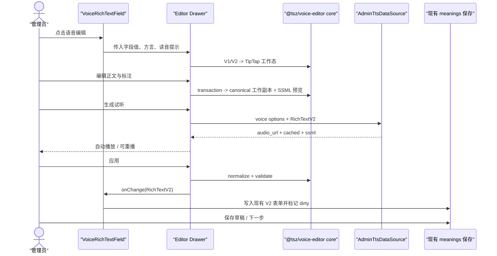

# 语音富文本编辑器技术设计文档

## 方案概述

新增独立 workspace 包 `packages/voice-editor`（包名 `@tsz/voice-editor`），在包内实现基于 TipTap 3 的定制语音富文本编辑器。业务页面不为每个深层字段常驻编辑器实例：它调用包提供的轻量 `VoiceRichTextField` 展示结构化标注预览，并复用一个 `VoiceRichTextEditor` 加载当前字段临时副本，完成编辑、TTS 试听和 PDF 导出，点击“应用”时再一次性写回业务表单。

TipTap 只负责编辑事务、选择和历史记录；持久化格式仍是 `@tsz/types` 的纯文本 + Unicode 码点标注。新增 `RichText version: 2` 作为可判别联合，兼容读取 `version: 1`，绝不保存 HTML 或 TipTap JSON。纯数据归一化、码点换算、V1→V2 迁移、SSML 序列化、TipTap 扩展、React 组件和只读 renderer 都由 `@tsz/voice-editor` 拥有。

TTS 采用供应商无关的 adapter。`@tsz/voice-editor` 只声明 `VoicePreviewAdapter` 并编排交互，不 import `@tsz/api-client`、鉴权或业务 data source；`apps/admin` 负责把后端“能力目录 + 临时试听”接口适配为该 adapter。后端重新校验结构化富文本并生成 SSML、缓存音频，再返回短期音频 URL 与实际使用的 SSML。本期不修改词条节点的 `audio_url`。

## 包分层与依赖方向

```text
apps/admin（词条字段、权限、dirty/revision、TTS data source）
    ↓ 只调用公开 exports，注入 adapter/callback
@tsz/voice-editor（编辑器 UI、TipTap、标注、只读渲染、SSML、打印）
    ↓
@tsz/types（RichText V1/V2 wire 类型）
```

依赖只能向下：

- `@tsz/voice-editor` 可以依赖 `@tsz/types`、TipTap，并把 React、ReactDOM、antd v6 声明为 peer dependency；antd 可标记为 optional peer，使只消费 `./core` 的非 admin 调用方无需安装它，组合 UI 调用方必须自行提供 antd v6；
- 不依赖 `apps/*`、`@tsz/api-client`、`@tsz/shared`、React Router、TanStack Query、admin 鉴权或环境变量；
- 包内组合 UI 使用 antd v6，以适配首个 admin 调用方；无样式的纯逻辑通过 `@tsz/voice-editor/core` 子路径导出，未来 web 若需要可复用 core 并另做 `@tsz/ui` 外壳；
- TTS 网络请求、错误码到用户提示的业务映射、feature flag 和 mock/real 选择都留在调用方。

### 包公开 exports

公开稳定子路径以支持业务层按需加载，禁止 import `src/*` 内部文件：

```json
{
  "exports": {
    ".": "./src/index.ts",
    "./core": "./src/core/index.ts",
    "./types": "./src/types.ts",
    "./reader": "./src/reader/index.ts",
    "./editor": "./src/editor/index.ts",
    "./styles.css": "./src/styles.css"
  }
}
```

- `@tsz/voice-editor`：完整便利入口与公开 props / adapter 类型；
- `@tsz/voice-editor/core`：码点工具、V1/V2 转换、normalizer、validator、SSML builder、canonical hash；
- `@tsz/voice-editor/types`：不加载 UI 的 TTS adapter、领域错误与组件公开类型；
- `@tsz/voice-editor/reader`：不加载 TipTap 的 `VoiceRichTextField`、`RichTextReadOnly`；
- `@tsz/voice-editor/editor`：可动态 import 的 `VoiceRichTextEditor` 与编辑器专用类型；
- `@tsz/voice-editor/styles.css`：编辑区与打印样式；颜色和尺寸使用 CSS variables/antd token，不泄漏全局选择器。

业务层典型调用：

```tsx
<VoiceRichTextEditor
  open={activeTarget !== undefined}
  value={workingValue}
  contextLabel={activeTarget?.label}
  pronunciationHints={pronunciationHints}
  previewAdapter={adminTtsAdapter}
  readOnly={readOnly}
  onApply={handleApply}
  onCancel={handleCancel}
/>
```

组件 props 使用 camelCase，`value/onApply` 使用 `@tsz/types` 的 canonical `RichText`。包不知道 active target 对应语法结构、释义还是例句，也不接收整棵 `AdminWordV2`。

TTS adapter 使用包内领域类型，不泄漏 HTTP wire：

```ts
export interface VoicePreviewAdapter {
  listVoices(input: {
    language: string;
    signal?: AbortSignal;
  }): Promise<VoiceOption[]>;
  synthesize(
    input: VoicePreviewRequest,
    options?: { signal?: AbortSignal }
  ): Promise<VoicePreviewResult>;
}
```

`VoiceOption / VoicePreviewRequest / VoicePreviewResult` 使用 camelCase。admin adapter 负责把它们与 `@tsz/types` 中的 snake_case TTS wire 类型互转，并把 `HttpError.code` 映射为包可展示的稳定错误状态。这样包的单元测试不需要模拟鉴权或 HttpClient。

### 为什么不直接搬 `laTex` Demo

- Demo 是独立 Vite 页面、全局 CSS 和单个编辑器；tsz 是包含大量深层字段、revision 与 dirty guard 的 admin 向导。
- Demo 直接 POST `application/ssml+xml` 并硬编码 Azure voice；生产前端不应持有供应商耦合或让后端执行任意 SSML。
- Demo 用 TipTap JSON 作为组件内部状态，但 tsz 的训练端契约要求 Unicode 码点偏移的结构化 `RichText`。
- Demo 的右侧 SSML 常驻占半屏；在词条向导内应降级为可折叠高级面板。

### 不采用的备选方案

- **原生 `contenteditable` 从零实现**：选择、输入法、撤销、粘贴、原子停顿节点和位置映射成本高，跨浏览器风险远大于 TipTap 扩展。
- **每个字段直接挂一个 TipTap 实例**：一个词条可能有数十个语法结构、释义和例句，会放大初始化、selection listener 和 ProseMirror DOM 成本。
- **持久化 HTML / TipTap JSON**：破坏现有安全模型与训练端偏移契约，也把编辑器库升级变成 wire 迁移。
- **继续扩展 `version: 1` 的 `spans/liaisons`**：旧结构无法无歧义表达 IPA、零宽停顿、多色高亮和区间连读；静默加 optional 字段会让旧消费者误判仍是 V1。

## 交互与组件结构

### 字段态

包内 `VoiceRichTextField` 接收 `value / language / dialectLabel / readOnly / onEdit`：

- 显示正文和已保存标注的轻量只读渲染，不初始化 TipTap；
- 编辑态显示“语音编辑”入口，已有临时/正式音频时显示播放状态；
- 只读态只渲染标注，不显示生成和应用操作；
- 中文字段首期继续走现有 `Input.TextArea`，不实例化本组件。

### 抽屉态

包内 `VoiceRichTextEditor` 使用 antd `Drawer`，桌面宽度约 `min(1180px, 100vw)`，窄屏全宽：

1. 顶部固定区：字段来源、方言、未应用状态、撤销/重做；
2. 标注工具栏：重音、连读、五色高亮、停顿预设、IPA、清除；
3. 主区：TipTap 正文编辑器；停顿和 IPA 使用锚定式 antd Popover；
4. 语音区：发音人、风格、语速、音高、生成试听、重播、状态；
5. 高级折叠区：实时 SSML；
6. 底部：取消、导出 PDF、应用。

编辑器内部持有 `workingValue`，并通过公开 `onDirtyChange` 告知调用方。切换字段前的业务级确认由 admin 控制；编辑器自己的关闭确认、应用和取消由包处理。“应用”只回调 canonical `RichTextV2`，不保存词条。步骤级 dirty guard 仍只由现有 `MeaningsAndExamplesStep` / wizard 管理。

## 结构化数据模型

### `RichText` 可判别联合

保留现有 V1 原样，新增 V2：

```ts
export interface RichTextV1 {
  version: 1;
  text: string;
  spans: Array<{
    start: number;
    end: number;
    type: "bold" | "blue";
  }>;
  liaisons: number[];
}

export type RichTextHighlightColor =
  "yellow" | "green" | "pink" | "blue" | "orange";

export type RichTextAnnotation =
  | {
      type: "emphasis";
      start: number;
      end: number;
      level: "strong";
    }
  | {
      type: "phoneme";
      start: number;
      end: number;
      alphabet: "ipa";
      phoneme: string;
    }
  | {
      type: "liaison";
      start: number;
      end: number;
    }
  | {
      type: "highlight";
      start: number;
      end: number;
      color: RichTextHighlightColor;
    }
  | {
      type: "pause";
      at: number;
      duration_ms: number;
    };

export interface RichTextV2 {
  version: 2;
  text: string;
  annotations: RichTextAnnotation[];
}

export type RichText = RichTextV1 | RichTextV2;
```

字段继续使用 snake_case。`start/end/at` 全部按 Unicode 码点计；范围是 `[start, end)`。换行保存在 `text` 中，标注不能跨段落边界。高亮保存语义 token 而非十六进制值，避免主题或视觉微调造成 wire 漂移。

### 归一化规则

`normalizeRichTextV2` 在应用、保存前执行：

- 校验正文 ≤ 5000 码点、annotations ≤ 500；
- 检测空区间与越界标注并返回显式校验错误，不能静默删除或截断用户输入；
- 同类型、同属性、相邻或重叠的 emphasis/highlight/liaison 合并；
- phoneme 之间不允许重叠，同一范围以最后一次明确操作替换；
- 同一 `at` 最多一个 pause，后设置值替换旧值；
- pause `duration_ms` 为整数 `1..5000`；
- 输出按位置、点标记优先级和类型稳定排序，保证缓存 hash 与快照可重复。

### V1 兼容

读取 V1 时不修改源对象；进入 TipTap 前生成工作态映射：

- `bold` → `emphasis/strong`；
- `blue` → `highlight/blue`；
- liaison 点 `i` → 覆盖相邻两个码点的 liaison 区间 `[i, i + 2)`，边界处收窄；
- V1 无法表达的 IPA / pause 不伪造。

只读/取消路径仍返回原 V1 引用。管理员点击“应用”后，工作态统一输出 V2。迁移需用现有 fixture 和包含 emoji 的样本做视觉快照，防止旧连读点显示意外变化。

### 文本编辑与位置更新

TipTap 内部使用 Document / Paragraph / Text / UndoRedo 加五个自定义扩展：`EmphasisMark`、`PhonemeMark`、`LiaisonMark`、`HighlightMark`、`PauseNode`。ProseMirror transaction 负责插入/删除时移动 mark 和 atom node；导出 canonical 数据时才把 ProseMirror position 转为 Unicode 码点偏移。

转换不得使用 `string.length`。共享工具以 `Array.from(text)` / 码点迭代表构建 DOM/ProseMirror position ↔ code-point offset 映射，并单测 emoji、代理对、组合字符、换行和 IPA 符号。

外部 `value` 变化时，仅当抽屉切换字段或服务端刷新出新 revision 才重置 editor content；普通 `onUpdate` 不能反向 `setContent`，否则会打断光标和 IME composition。

## SSML 语义

客户端 `buildSsmlPreview` 与服务端实现共用同一份语义规则，但服务端是最终权威：

- 文本、voice/style 属性和 IPA 全部 XML escape；
- emphasis → `<emphasis level="strong">`；
- phoneme → `<phoneme alphabet="ipa" ph="…">`；
- pause → `<break time="Nms"/>`；
- 段落换行默认插入 `500ms` break；
- liaison 与 highlight 是纯教学视觉，不进入 SSML；
- 整体 rate/pitch 包裹 `<prosody>`；
- style 仅在 voice capability 明确支持时生成供应商扩展节点。

标注嵌套顺序必须确定：phoneme 在内、emphasis 在外；禁止会产生交叉 XML 的区间组合，或在序列化前按文本片段切分成合法嵌套。SSML 预览不使用 `dangerouslySetInnerHTML`，只作为 `<pre>` 文本呈现。

## TTS 后端对接建议

### 当前事实

- `../docs/admin-wordlist-frontend-integration.md` §3.3、§7 明确 `audio_url / audio_source` 是服务端自有只读字段，TTS/上传接口尚未定义。
- `../tsz-rust/docs/openapi.json` 当前没有词库和 TTS 路由。
- `../tsz-rust/docs/frontend-integration.md` 只记录了词条/词性配置的 mock-first 提案，没有本功能需要的发音人目录与试听接口。
- 因此本功能不能声称已有真实后端；接口先进入 api-client PENDING 台账，前端以 typed mock 完成交互，真实开关默认关闭。

### 建议契约变更：RichText V2

tsz-rust 的 V2 词条 meanings 保存/读取契约需要接受 `RichTextV1 | RichTextV2`，并原样返回服务端实际保存的版本：

- V2 词条的英语语法结构、英语释义和英文例句允许保存 RichText V2；
- legacy V1 词条接口继续只接受 RichText V1，避免旧编辑器读不懂 V2 后覆盖标注；
- 服务端按本设计的码点、范围、重叠、数量、颜色和 pause 时长规则再次校验；
- 服务端不自动把历史 V1 批量改写为 V2，只在前端明确提交新版值时保存 V2；
- 后续学习端/题目生成消费者在启用 V2 写入前必须具备 V1/V2 双读能力；
- 建议增加稳定问题码 `unsupported_rich_text_version`、`invalid_rich_text_annotation`，并用 `field` 指向具体内容节点。

该变更需要后端团队更新 `../tsz-rust/docs/frontend-integration.md` 与 OpenAPI 后再解除真实接口开关；本仓只提交前端类型、mock 和 PENDING 契约，不修改 Rust 实现。

### 建议接口 1：发音人能力目录

`GET /api/v1/admin/tts/voices?language=en`

```ts
export interface AdminTtsVoice {
  id: string;
  label: string;
  locale: string;
  gender: "female" | "male" | "neutral";
  styles: string[];
  supports_rate: boolean;
  supports_pitch: boolean;
  is_default: boolean;
}

export interface AdminTtsVoiceListResponse {
  items: AdminTtsVoice[];
}
```

`id` 是服务端稳定别名，不直接暴露供应商 key。目录可缓存，但供应商变更后无需发前端版本。

### 建议接口 2：临时试听

`POST /api/v1/admin/tts/previews`

```ts
export interface CreateAdminTtsPreviewInput {
  language: "en";
  content: RichTextV2;
  voice_id: string;
  style?: string;
  rate_percent?: number; // 建议 -50..100，前端首期只给 -10/-5/0/5/10
  pitch_semitones?: number; // 建议 -12..12，前端首期只给 -2/-1/0/1/2
}

export interface AdminTtsPreviewResponse {
  audio_url: string;
  expires_at: string;
  cached: boolean;
  ssml: string;
}
```

服务端流程：校验 canonical RichText 和 voice capability → 生成规范 SSML → 用规范化内容 + 参数 + voice/provider version 做 hash → 命中缓存则复用，否则调用供应商 → 返回短期授权 URL。不要把供应商密钥、内部路径或永久公网 URL 下发前端。

建议问题码（RFC 9457）：`invalid_speech_markup`、`tts_voice_not_found`、`tts_option_not_supported`、`tts_rate_limited`、`tts_quota_exceeded`、`tts_unavailable`。前端按 `code` 分支，不匹配 `detail` 文案。

试听不更新词条 revision，也不写 `audio_url`。后续永久音频资产模块应另设“生成并绑定到 node_id”的幂等接口，不复用 preview 端点偷偷落库。

### typed mock

在 admin dictionary data source 旁新增 `AdminTtsDataSource`：

- mock voice catalog 提供美音女/男、英音女/男和至少一个支持风格的 voice；
- preview mock 返回稳定的短音频 fixture、`cached` 状态与服务端规范化 SSML；
- 生产构建禁止启用 TTS mock，与现有 admin mock 防泄漏规则一致；
- 未启用真实 TTS 时，编辑标注和保存仍可用，生成按钮 disabled 并说明后端未就绪。

## 数据流 / 时序



## 代码影响范围

以下是评审通过后的预计实施清单；实际发现差异时先更新本文再动工。

### `@tsz/types`

- 新增 `packages/types/src/rich-text.ts`：抽出 `RichTextV1`，新增 `RichTextV2`、annotation 联合和 type guards。
- 修改 `packages/types/src/admin-word.ts`：从新文件导入/重导出 `RichText`，保持现有消费路径兼容。
- 新增 `packages/types/src/admin-tts.ts`：voice catalog、preview request/response wire 类型。
- 修改 `packages/types/src/index.ts`：导出新类型。

### `@tsz/voice-editor` 独立包

- 新增 `packages/voice-editor/package.json`：包名 `@tsz/voice-editor`，声明根入口、`./core`、`./reader`、`./editor` 和 `./styles.css` exports；React、ReactDOM、antd v6 为 peer dependency（antd 对纯 core 消费标记 optional），TipTap 与 `@tsz/types` 为直接依赖；包含 lint/typecheck/test scripts。
- 新增 `packages/voice-editor/tsconfig.json`、`vitest.config.ts` 与 `vitest.setup.ts`，沿用 `@tsz/config`；jsdom setup 提供 antd v6 需要的 `matchMedia / ResizeObserver` 垫片。
- 新增 `packages/voice-editor/src/core/codepoints.ts`：Unicode 码点索引与位置映射。
- 新增 `src/core/normalize.ts`：V2 校验、排序、合并与 V1→V2 工作态迁移。
- 新增 `src/core/ssml.ts`：客户端只读 SSML 预览构造器。
- 新增 `src/core/hash.ts`：canonical 内容与 voice options 的稳定 hash。
- 新增 `src/editor/extensions.ts`：emphasis、phoneme、liaison、highlight、pause TipTap 扩展。
- 新增 `src/editor/mapping.ts`：TipTap JSON / selection 与 canonical RichText 的双向转换。
- 新增 `src/reader/VoiceRichTextField.tsx`：轻量字段展示与编辑入口。
- 新增 `src/editor/VoiceRichTextEditor.tsx`：唯一活动编辑器、Drawer 工作副本、应用/取消、语音与打印编排。
- 新增 `src/reader/RichTextReadOnly.tsx`；标注浮层、语音控制和 SSML 预览由 `VoiceRichTextEditor.tsx` 内聚编排。
- 新增 `src/types.ts`：camelCase 组件 props、`VoicePreviewAdapter` 与领域状态。
- 新增各公开入口的 `index.ts` 和局部 `src/styles.css`；样式只作用于包根 class。
- 包内纯逻辑与组件按 `packages/**` 质量门补齐 100% 覆盖率。

### `@tsz/api-client`

- 修改 `packages/api-client/src/admin.ts`：新增 `tts.voices()`、`tts.preview(input)`。
- 修改 `packages/api-client/src/admin.test.ts`：验证 method/path/query/body 和 snake_case。
- 修改 `packages/api-client/src/endpoints.contract.test.ts`：在后端 OpenAPI 落地前加入并保鲜以下 PENDING：
  - `get /admin/tts/voices`
  - `post /admin/tts/previews`

### admin 数据边界

- 新增 `apps/admin/src/features/dictionary/voice-editor/dataSource.ts`：real/mock adapter 选择。
- 新增 `apps/admin/src/features/dictionary/voice-editor/mock.ts` 与短音频测试 fixture。
- 新增 `apps/admin/src/features/dictionary/voice-editor/adapter.ts`：把 snake_case wire/data source 映射为包的 camelCase `VoicePreviewAdapter`。
- 修改 `apps/admin/src/lib/env.ts`、`env-flags.ts` 与对应测试：编辑器/TTS mock feature flag，生产禁用 mock。

### admin 包接入

- 修改 `apps/admin/package.json`：增加 `@tsz/voice-editor: workspace:*`；TipTap 不直接出现在 admin 依赖中。
- 更新根 `pnpm-lock.yaml` 记录新 workspace 包及依赖。
- admin 从 `@tsz/voice-editor/reader` 静态导入轻量字段/renderer，在首次打开时动态 import `@tsz/voice-editor/editor`；从公开 CSS 入口导入样式，禁止 `src/*` 深路径 import。
- 业务层维护 active target、词条字段回写、权限、feature flag、dirty/revision 和错误 toast；不复制编辑器内部状态。

### V2 词条创编接入

- 修改 `apps/admin/src/features/dictionary/word-creation/MeaningsAndExamplesStep.tsx`：
  - 英语语法结构、英语释义和英文例句用 `VoiceRichTextField`；
  - 页面/步骤级挂一个包提供的 `VoiceRichTextEditor`，字段只传 active target；
  - 从 forms/headwords 构造 `pronunciationHints`；
  - 注入 `voiceEditorAdapter`，把包的应用回调写回正确 node id；
  - 保留中文 TextArea 与现有方言切换、missing/ready、origin 逻辑。
- 修改 `apps/admin/src/features/dictionary/word-creation/model.ts` 和 `word-model/primitives.ts`：文本变化不再无条件清空所有 V2 标注，由包内 transaction/normalizer 维护；非编辑器路径改变正文时仍 fail-safe 清空失效标注。
- 修改 `PreviewAndPublishStep.tsx`：使用包导出的 `RichTextReadOnly` 展示 V1/V2 标注。
- 逐步替换 meanings 中当前 Mock 语音按钮；音频上传仍保持独立占位，不并入编辑器。

## 复用与项目约定

- wire 类型继续集中在 `@tsz/types`；`@tsz/voice-editor` 不复制 `RichText` 与 TTS wire 类型。
- 用户明确要求编辑器作为独立 package 交付，因此编辑器领域内的码点、标注、SSML 和 TipTap 映射由该包内聚拥有，不再拆到 `@tsz/shared` 形成跨包双向耦合；其他业务不得复制这些逻辑。
- 真实 HTTP 请求仍只经过 `@tsz/api-client`，但调用发生在 admin 的 adapter/data source，编辑器包只看到领域化异步接口。
- admin 组合 UI 使用 antd v6；包不引入 tailwind 或 `@tsz/ui`，不影响 web 的 UI 分叉约定。
- `@tsz/types` / API 保持 snake_case，组件 props 与包内状态使用 camelCase。
- 鉴权、401 刷新、路由门禁和退出竞态都由现有 admin 壳处理，编辑器包不建立第二套鉴权逻辑。
- 业务调用只使用 package exports；包边界通过 ESLint `no-restricted-imports` 或等价架构测试守住。

## React 与状态约定

- 业务层只挂一个 `VoiceRichTextEditor`；active target 用稳定 `{ node_id, field, dialect }` 标识，不能靠数组下标，因为列表可重排。该对象只存在 admin，不进入包 props。
- 包内部 draft 与外部业务 Form 值隔离；只有“应用”触发 `onApply(RichTextV2)`。
- 包通过 adapter 发起 TTS，并传入 `AbortSignal`；关闭/改内容/改参数后过期响应不能覆盖当前状态。
- audio URL 与包内 canonical hash 绑定；hash 变化立即把旧结果标为 stale。切换结果时 pause 旧 Audio，组件卸载时清理。
- 包内 `useEditor`、document pointer listener、afterprint listener 和临时 URL 都必须在 effect cleanup 中释放。
- 选择态和 undo/redo 状态来自 TipTap transaction，不从 DOM 文本反推。
- 包从不接收整个 `DraftMeaningsStepContent`；业务层在应用时沿用现有 clone/update 路径，避免无关卡片重渲染。

## 打印 / PDF

- `@tsz/voice-editor` 内维护专用 print root；触发打印时给 `body` 加 scoped class，只让当前 print root 可见。
- print root 使用 `RichTextReadOnly`，避免直接打印 contenteditable 选择框和 pause node。
- print renderer 隐藏 pause，保留其他视觉标注与 IPA 字体；`afterprint` 和定时兜底都必须幂等清理 body class。
- 首期不生成服务器 PDF，也不引入 jsPDF；浏览器打印能保持矢量文字且与参考实现等价。

## 测试策略（概览）

动工阶段先调用 `test` skill 完成用例矩阵，再写测试代码。

### 单元测试

- `@tsz/voice-editor/core`：码点映射、范围合并、交叉标注、pause 边界、V1 迁移、XML escape、SSML 嵌套、canonical hash 与稳定排序，覆盖 emoji/组合字符/IPA/换行。
- 包内 TipTap mapping：V1/V2 → editor → V2 往返；正文插删后标注位置；atom pause；粘贴清洗。
- TTS data source：能力目录、缓存命中、错误码、过期响应。

### 组件 / 集成测试

- 包组件：Drawer 打开/取消/应用、dirty 状态、无 TTS adapter 降级与公开 API 行为。
- 无选区按钮禁用；重音/连读/高亮/IPA/停顿/清除/undo/redo。
- voice capability 联动、loading、防重复、失败保留、stale audio、重播与 cleanup。
- admin 集成：稳定 node id 回写、方言与字段不串位、大型 meanings 页面只创建一个 TipTap 实例；测试查询按局部容器定位，避免大表格 `getByRole` 超时。
- 只读预览、V1 兼容、中文字段回归、origin 与 missing 方言回归。

### E2E / 手测

- admin mock 向导：编辑英文例句 → 添加全部标注 → 生成 mocked TTS → 应用 → 保存 → 刷新恢复。
- 英美方言切换后各自标注不串位，排序节点后仍回写正确 node id。
- 浏览器手测中文输入法、英文输入、emoji、复制粘贴、键盘快捷键、窄屏抽屉、PDF 打印预览和真实音频播放。
- 真实后端就绪后补 voice catalog / preview smoke，确认鉴权、限流、缓存和供应商失败映射。

## 风险与缓解

- **后端契约缺失**：端点进入 PENDING，真实功能默认关闭；typed mock 不能在生产启用。
- **RichText 升级影响旧消费者**：使用版本联合，不原地扩展 V1；V1 只在明确应用后升级；legacy 路由首期不写 V2。
- **Unicode 偏移漂移**：所有边界集中到共享码点工具，禁止散落 `string.length/slice`；用复杂字符做往返测试。
- **包边界被业务侵蚀**：用 ESLint/import 测试禁止包依赖 apps、api-client、router 和 query；业务 DTO 映射只放调用方。
- **TipTap 与深层表单性能**：字段轻量渲染、包组件单实例、稳定 node id、按需加载 `@tsz/voice-editor` chunk。
- **供应商能力差异**：voice catalog 描述能力；UI 只允许可支持组合；服务端再次验证。
- **SSML 注入/不一致**：前端只预览，服务端从 canonical 数据重建；属性和值统一 escape。
- **试听计费与滥用**：服务端按 admin、内容 hash 和时间窗限流并缓存；前端防重复只是体验优化，不替代后端控制。
- **打印污染整页**：scoped body class + 专用 print root + 双清理机制，并在 e2e/手测覆盖取消打印。
- **音频与内容版本错配**：试听结果绑定 canonical hash，内容/参数变化立即 stale，不把 preview 写入正式 audio 字段。

## 回滚方案

- 通过独立 feature flag 关闭编辑器入口，恢复现有 `Input.TextArea` 与 Mock VoiceActions；已有 V1 数据完全不受影响。
- 若前端编辑器问题但后端已接受 V2，可保留只读 renderer，暂时禁止 V2 写入并提示管理员使用旧路径。
- TTS 单独可降级：关闭生成按钮不影响正文标注、应用和步骤保存。
- 不删除已保存 V2 数据；回滚版本必须至少能识别 `version: 2` 并只读展示或明确阻止覆盖，不能用 V1 空标注覆盖。
